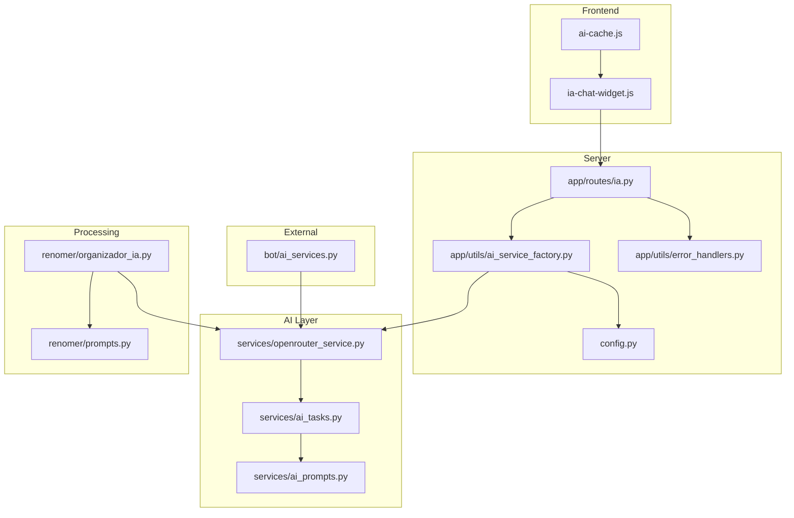
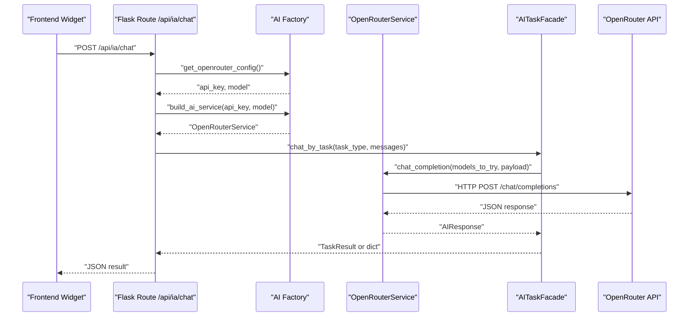
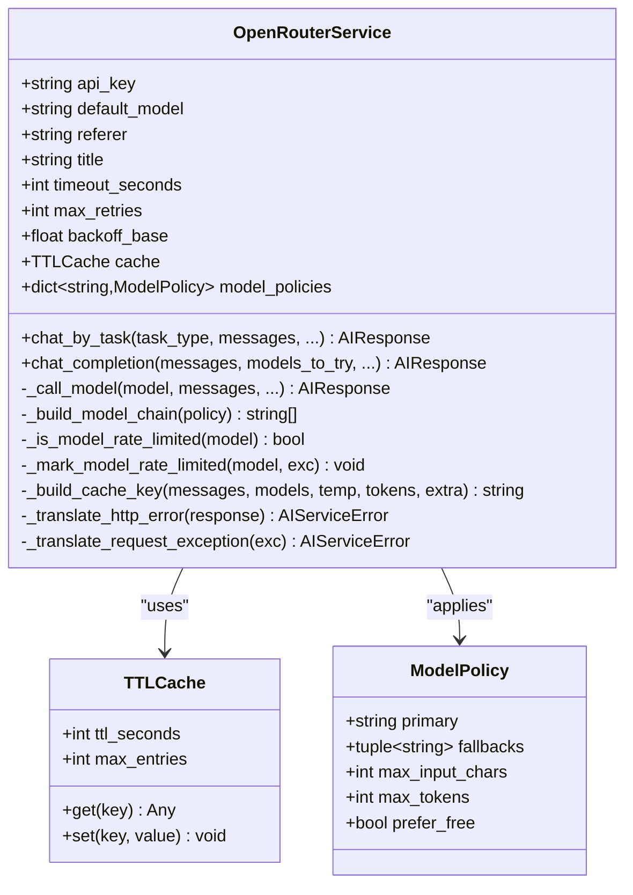
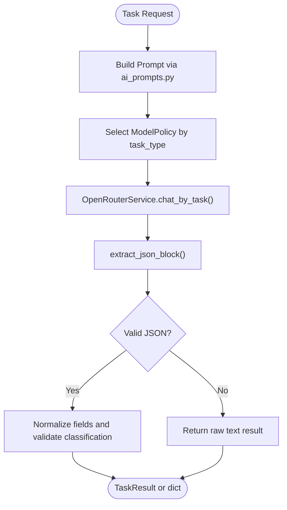
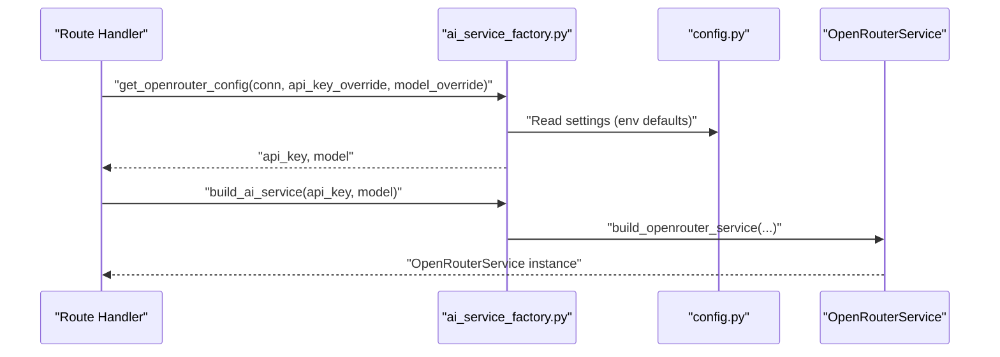
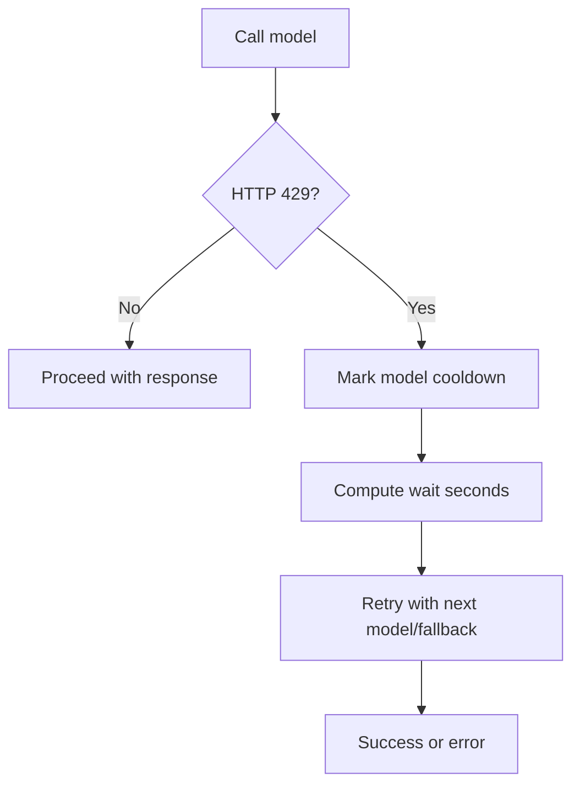
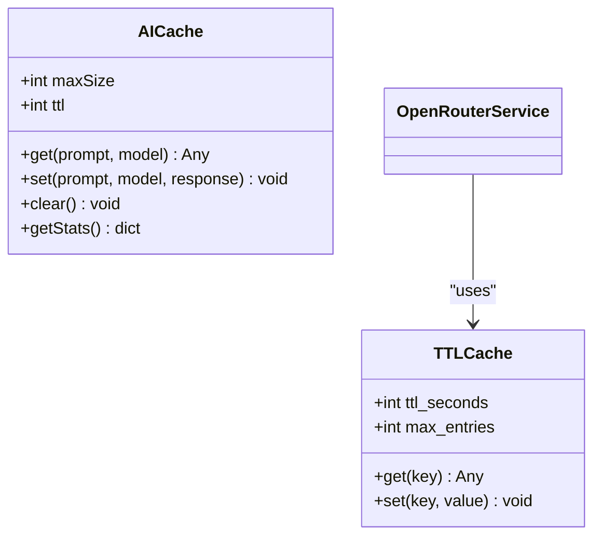
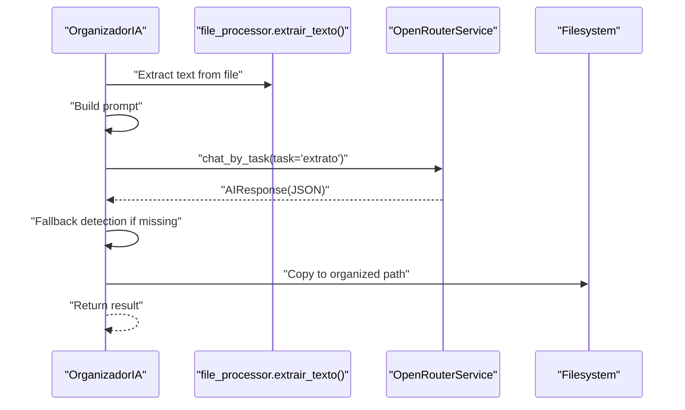
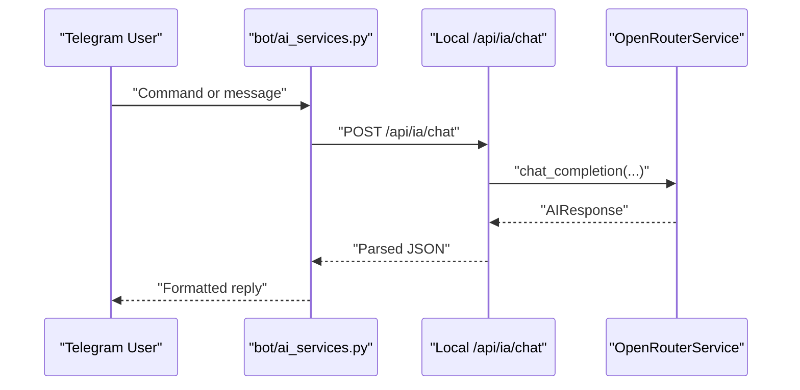
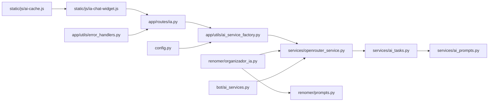

# AI Services Integration

<cite>
**Referenced Files in This Document**
- [ai_service_factory.py](file://app/utils/ai_service_factory.py)
- [openrouter_service.py](file://services/openrouter_service.py)
- [ai_prompts.py](file://services/ai_prompts.py)
- [ai_tasks.py](file://services/ai_tasks.py)
- [ia.py](file://app/routes/ia.py)
- [organizador_ia.py](file://renomer/organizador_ia.py)
- [prompts.py](file://renomer/prompts.py)
- [ai_services.py](file://bot/ai_services.py)
- [ia-chat-widget.js](file://static/js/ia-chat-widget.js)
- [ai-cache.js](file://static/js/ai-cache.js)
- [config.py](file://config.py)
- [error_handlers.py](file://app/utils/error_handlers.py)
- [server.py](file://server.py)
- [app/__init__.py](file://app/__init__.py)
</cite>

## Table of Contents
1. [Introduction](#introduction)
2. [Project Structure](#project-structure)
3. [Core Components](#core-components)
4. [Architecture Overview](#architecture-overview)
5. [Detailed Component Analysis](#detailed-component-analysis)
6. [Dependency Analysis](#dependency-analysis)
7. [Performance Considerations](#performance-considerations)
8. [Troubleshooting Guide](#troubleshooting-guide)
9. [Conclusion](#conclusion)
10. [Appendices](#appendices)

## Introduction
This document explains how AI services are integrated into the municipal financial management system. It covers the OpenRouter API integration, the AI service abstraction layer, caching mechanisms, and how AI powers document categorization, text extraction, and automated processing workflows. It also documents the AI service factory pattern, rate limiting strategies, error handling procedures, prompt engineering guidelines, model selection criteria, response processing workflows, the AI-powered document organization system, chat completion services, and integration with Telegram bot features. Implementation examples, performance optimization tips, and troubleshooting guidance are included.

## Project Structure
The AI integration spans backend services, frontend widgets, CLI/Telegram bot wrappers, and configuration. Key areas:
- Backend AI abstraction and tasks: services/openrouter_service.py, services/ai_tasks.py, services/ai_prompts.py
- Application routes: app/routes/ia.py
- Frontend AI widget and cache: static/js/ia-chat-widget.js, static/js/ai-cache.js
- AI-powered document organization: renomer/organizador_ia.py, renomer/prompts.py
- Telegram bot integration: bot/ai_services.py
- Centralized factory and configuration: app/utils/ai_service_factory.py, config.py
- Global error handling: app/utils/error_handlers.py
- Application factory and server bootstrap: app/__init__.py, server.py

**Diagram sources**
- [ia.py:12-124](file://app/routes/ia.py#L12-L124)
- [ai_service_factory.py:9-57](file://app/utils/ai_service_factory.py#L9-L57)
- [openrouter_service.py:72-136](file://services/openrouter_service.py#L72-L136)
- [ai_tasks.py:22-454](file://services/ai_tasks.py#L22-L454)
- [ai_prompts.py:13-207](file://services/ai_prompts.py#L13-L207)
- [organizador_ia.py:20-158](file://renomer/organizador_ia.py#L20-L158)
- [prompts.py:53-119](file://renomer/prompts.py#L53-L119)
- [ai-services.py:12-186](file://bot/ai_services.py#L12-L186)
- [ia-chat-widget.js:48-237](file://static/js/ia-chat-widget.js#L48-L237)
- [ai-cache.js:4-70](file://static/js/ai-cache.js#L4-L70)
- [config.py:18-64](file://config.py#L18-L64)
- [error_handlers.py:9-145](file://app/utils/error_handlers.py#L9-L145)

**Section sources**
- [server.py:113-421](file://server.py#L113-L421)
- [app/__init__.py:107-162](file://app/__init__.py#L107-L162)

## Core Components
- OpenRouter service abstraction: encapsulates HTTP calls, retries, rate limiting, TTL caching, and response parsing.
- AI task facade: orchestrates prompt building, task-specific policies, and structured JSON extraction.
- Prompt templates: standardized system/user prompts for document classification, expense processing, and file renaming.
- AI service factory: centralizes configuration resolution and service construction.
- Document organization pipeline: integrates OCR text extraction with AI classification and fallback detection.
- Chat completion endpoints: REST APIs for chat and document organization.
- Frontend AI widget and cache: interactive chat UI and client-side response caching.
- Telegram bot wrappers: async OpenRouter and local AI invocation with retry logic and JSON parsing.

**Section sources**
- [openrouter_service.py:72-136](file://services/openrouter_service.py#L72-L136)
- [ai_tasks.py:22-454](file://services/ai_tasks.py#L22-L454)
- [ai_prompts.py:13-207](file://services/ai_prompts.py#L13-L207)
- [ai_service_factory.py:9-57](file://app/utils/ai_service_factory.py#L9-L57)
- [organizador_ia.py:20-158](file://renomer/organizador_ia.py#L20-L158)
- [ia.py:12-124](file://app/routes/ia.py#L12-L124)
- [ia-chat-widget.js:48-237](file://static/js/ia-chat-widget.js#L48-L237)
- [ai-cache.js:4-70](file://static/js/ai-cache.js#L4-L70)
- [ai_services.py:12-186](file://bot/ai_services.py#L12-L186)

## Architecture Overview
The AI integration follows a layered architecture:
- Presentation: Frontend widget and Telegram bot invoke backend endpoints or local services.
- API layer: Flask routes expose chat and document organization endpoints.
- Abstraction layer: OpenRouter service handles provider communication, retries, and caching.
- Task orchestration: AI task facade applies task-specific policies and prompt templates.
- Processing: Document organization uses OCR text plus AI classification with fallbacks.
- Configuration: Environment and database-backed settings drive model selection and timeouts.

**Diagram sources**
- [ia.py:31-76](file://app/routes/ia.py#L31-L76)
- [ai_service_factory.py:9-57](file://app/utils/ai_service_factory.py#L9-L57)
- [openrouter_service.py:99-136](file://services/openrouter_service.py#L99-L136)
- [ai_tasks.py:26-90](file://services/ai_tasks.py#L26-L90)

## Detailed Component Analysis

### OpenRouter Service Abstraction
The OpenRouter service encapsulates:
- Request building, headers, and payload composition.
- Retry/backoff logic for transient failures and timeouts.
- Provider error translation to user-friendly exceptions.
- Shared model-level rate limiting with cooldown tracking.
- TTL-based caching keyed by normalized request parameters.
- Response parsing utilities for text and usage metrics.

**Diagram sources**
- [openrouter_service.py:72-136](file://services/openrouter_service.py#L72-L136)
- [openrouter_service.py:45-70](file://services/openrouter_service.py#L45-L70)
- [openrouter_service.py:37-43](file://services/openrouter_service.py#L37-L43)

**Section sources**
- [openrouter_service.py:72-136](file://services/openrouter_service.py#L72-L136)
- [openrouter_service.py:149-184](file://services/openrouter_service.py#L149-L184)
- [openrouter_service.py:186-193](file://services/openrouter_service.py#L186-L193)
- [openrouter_service.py:195-214](file://services/openrouter_service.py#L195-L214)
- [openrouter_service.py:233-235](file://services/openrouter_service.py#L233-L235)
- [openrouter_service.py:311-320](file://services/openrouter_service.py#L311-L320)

### AI Task Facade and Prompt Engineering
The AI task facade:
- Maps actions to prompt templates and applies task-specific constraints (temperature, max tokens, cache behavior).
- Extracts structured JSON from AI responses and validates/normalizes classifications.
- Provides composite workflows (e.g., extract fields, generate description, improve description, checklist).

Prompt engineering guidelines embedded in templates:
- Consistent system prompts with response style instructions.
- Structured JSON schemas in user prompts for reliable parsing.
- Examples and explicit constraints for classification accuracy.

**Diagram sources**
- [ai_tasks.py:26-90](file://services/ai_tasks.py#L26-L90)
- [ai_tasks.py:147-169](file://services/ai_tasks.py#L147-L169)
- [ai_tasks.py:171-198](file://services/ai_tasks.py#L171-L198)
- [ai_prompts.py:13-29](file://services/ai_prompts.py#L13-L29)
- [openrouter_service.py:89-97](file://services/openrouter_service.py#L89-L97)

**Section sources**
- [ai_tasks.py:22-454](file://services/ai_tasks.py#L22-L454)
- [ai_prompts.py:13-207](file://services/ai_prompts.py#L13-L207)

### AI Service Factory Pattern
The factory resolves configuration precedence and constructs AI services consistently:
- Priority: override parameters > database configuration > environment variables > defaults.
- Centralized construction of OpenRouter service and task facade.

**Diagram sources**
- [ai_service_factory.py:9-33](file://app/utils/ai_service_factory.py#L9-L33)
- [ai_service_factory.py:36-50](file://app/utils/ai_service_factory.py#L36-L50)
- [config.py:18-64](file://config.py#L18-L64)

**Section sources**
- [ai_service_factory.py:9-57](file://app/utils/ai_service_factory.py#L9-L57)
- [config.py:18-64](file://config.py#L18-L64)

### Rate Limiting Strategies
Shared model-level rate limiting:
- Detects 429 responses and marks model cooldown with dynamic wait calculation.
- Enforces per-model lock to avoid concurrent calls during cooldown.
- Falls back to configured fallback models when primary is rate-limited.

**Diagram sources**
- [openrouter_service.py:114-134](file://services/openrouter_service.py#L114-L134)
- [openrouter_service.py:210-213](file://services/openrouter_service.py#L210-L213)
- [openrouter_service.py:280-308](file://services/openrouter_service.py#L280-L308)

**Section sources**
- [openrouter_service.py:195-214](file://services/openrouter_service.py#L195-L214)
- [openrouter_service.py:251-266](file://services/openrouter_service.py#L251-L266)
- [openrouter_service.py:280-308](file://services/openrouter_service.py#L280-L308)

### Caching Mechanisms
Two complementary caching layers:
- Server-side TTL cache inside OpenRouterService for identical requests.
- Client-side cache manager for frontend responses.

**Diagram sources**
- [openrouter_service.py:45-70](file://services/openrouter_service.py#L45-L70)
- [ai-cache.js:4-70](file://static/js/ai-cache.js#L4-L70)

**Section sources**
- [openrouter_service.py:45-70](file://services/openrouter_service.py#L45-L70)
- [ai-cache.js:4-70](file://static/js/ai-cache.js#L4-L70)

### AI-Powered Document Organization
The organization pipeline:
- Extracts text from PDF/OFX files.
- Builds prompt with filename and content.
- Calls OpenRouter with task-specific policy.
- Parses JSON response and falls back to local detection if needed.
- Generates destination path and copies file.

**Diagram sources**
- [organizador_ia.py:38-70](file://renomer/organizador_ia.py#L38-L70)
- [organizador_ia.py:72-156](file://renomer/organizador_ia.py#L72-L156)
- [prompts.py:53-119](file://renomer/prompts.py#L53-L119)

**Section sources**
- [organizador_ia.py:20-158](file://renomer/organizador_ia.py#L20-L158)
- [prompts.py:53-119](file://renomer/prompts.py#L53-L119)

### Chat Completion Services and Telegram Bot Integration
- REST endpoints expose chat and document organization via POST to /api/ia/chat and /api/ia/organizar-extratos.
- Telegram bot wrappers call OpenRouter directly or route through local /api/ia/chat, with retry and JSON parsing.

**Diagram sources**
- [ai_services.py:12-186](file://bot/ai_services.py#L12-L186)
- [ia.py:31-76](file://app/routes/ia.py#L31-L76)
- [openrouter_service.py:149-184](file://services/openrouter_service.py#L149-L184)

**Section sources**
- [ia.py:12-124](file://app/routes/ia.py#L12-L124)
- [ai_services.py:12-186](file://bot/ai_services.py#L12-L186)

## Dependency Analysis
- Routes depend on the AI factory for configuration and on the OpenRouter service for completions.
- AI tasks depend on prompt templates and the OpenRouter service.
- Document organization depends on OCR extraction, OpenRouter service, and prompt builders.
- Frontend widget depends on REST endpoints and client-side cache.
- Telegram bot depends on OpenRouter or local endpoints.

**Diagram sources**
- [ia.py:12-124](file://app/routes/ia.py#L12-L124)
- [ai_service_factory.py:9-57](file://app/utils/ai_service_factory.py#L9-L57)
- [openrouter_service.py:72-136](file://services/openrouter_service.py#L72-L136)
- [ai_tasks.py:22-454](file://services/ai_tasks.py#L22-L454)
- [ai_prompts.py:13-207](file://services/ai_prompts.py#L13-L207)
- [organizador_ia.py:20-158](file://renomer/organizador_ia.py#L20-L158)
- [prompts.py:53-119](file://renomer/prompts.py#L53-L119)
- [ia-chat-widget.js:48-237](file://static/js/ia-chat-widget.js#L48-L237)
- [ai-cache.js:4-70](file://static/js/ai-cache.js#L4-L70)
- [ai-services.py:12-186](file://bot/ai_services.py#L12-L186)
- [error_handlers.py:9-145](file://app/utils/error_handlers.py#L9-L145)
- [config.py:18-64](file://config.py#L18-L64)

**Section sources**
- [app/__init__.py:107-162](file://app/__init__.py#L107-L162)
- [server.py:113-421](file://server.py#L113-L421)

## Performance Considerations
- Prefer free fallback models for cost control and resilience.
- Use task-specific model policies to limit input size and token limits.
- Enable caching for repeated queries; tune TTL to balance freshness and cost.
- Apply truncation and prompt limits to reduce token usage.
- Use streaming where supported to improve perceived latency.
- Minimize retries for non-transient errors to avoid cascading delays.
- Cache frontend responses locally to reduce repeated network calls.

[No sources needed since this section provides general guidance]

## Troubleshooting Guide
Common issues and resolutions:
- Missing API key: Ensure OPENROUTER_API_KEY is configured in environment or stored in database under the appropriate key.
- Rate limiting: The service tracks cooldowns per model; reduce frequency or switch models.
- Invalid or empty responses: Verify prompt formatting and JSON schema expectations; ensure content is not truncated excessively.
- Network errors: Inspect timeouts and retry configuration; check connectivity to OpenRouter endpoints.
- Authentication failures: Confirm Authorization header and provider credentials.
- JSON parsing errors: Validate that AI returns structured JSON; use extractors designed for robust parsing.

**Section sources**
- [openrouter_service.py:13-24](file://services/openrouter_service.py#L13-L24)
- [openrouter_service.py:251-266](file://services/openrouter_service.py#L251-L266)
- [openrouter_service.py:364-403](file://services/openrouter_service.py#L364-L403)
- [error_handlers.py:9-145](file://app/utils/error_handlers.py#L9-L145)

## Conclusion
The AI services integration leverages a robust abstraction over OpenRouter, a factory-driven configuration system, and task-specific orchestration. It provides resilient, cache-aware, and prompt-engineered workflows for document categorization, text extraction, and automated processing. The system supports both REST endpoints and Telegram bot integrations, with frontend caching and comprehensive error handling to ensure reliability and usability.

[No sources needed since this section summarizes without analyzing specific files]

## Appendices

### Prompt Engineering Guidelines
- Keep system prompts precise and aligned with task outcomes.
- Use explicit JSON schemas in user prompts to guide structured outputs.
- Include examples and constraints for classification tasks.
- Limit context length to fit model constraints; truncate when necessary.

**Section sources**
- [ai_prompts.py:13-207](file://services/ai_prompts.py#L13-L207)

### Model Selection Criteria
- Choose primary models for production tasks; define fallbacks for free tier availability.
- Prefer free models for low-sensitivity tasks to reduce cost.
- Tune max_input_chars and max_tokens per task to optimize cost and performance.

**Section sources**
- [openrouter_service.py:311-320](file://services/openrouter_service.py#L311-L320)

### Response Processing Workflows
- Use extractors to reliably parse JSON blocks from AI responses.
- Normalize classification outputs to ensure consistent field values.
- Validate confidence thresholds and provide alternatives when low.

**Section sources**
- [openrouter_service.py:382-403](file://services/openrouter_service.py#L382-L403)
- [ai_tasks.py:200-314](file://services/ai_tasks.py#L200-L314)

### Implementation Examples
- Chat endpoint usage: see route handlers for chat and document organization.
- Factory usage: see factory functions for constructing services and facades.
- Frontend widget: see interactive widget and cache manager for client-side caching.
- Telegram bot: see wrapper functions for async OpenRouter and local AI calls.

**Section sources**
- [ia.py:31-124](file://app/routes/ia.py#L31-L124)
- [ai_service_factory.py:9-57](file://app/utils/ai_service_factory.py#L9-L57)
- [ia-chat-widget.js:48-237](file://static/js/ia-chat-widget.js#L48-L237)
- [ai-cache.js:4-70](file://static/js/ai-cache.js#L4-L70)
- [ai_services.py:12-186](file://bot/ai_services.py#L12-L186)