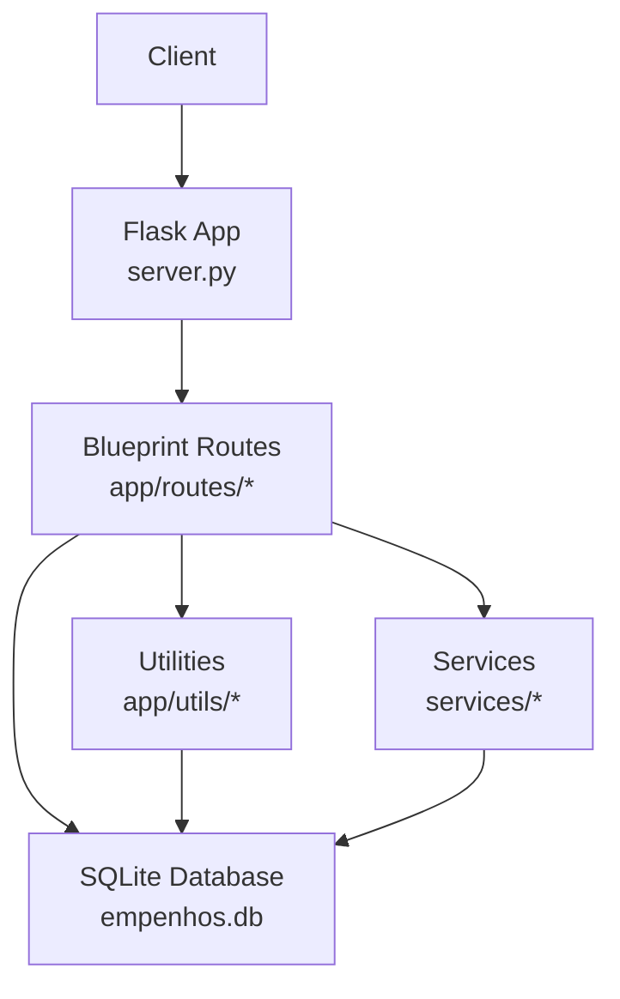
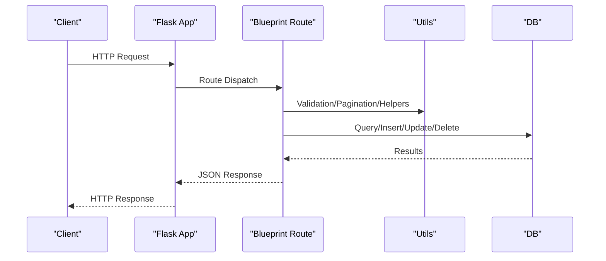
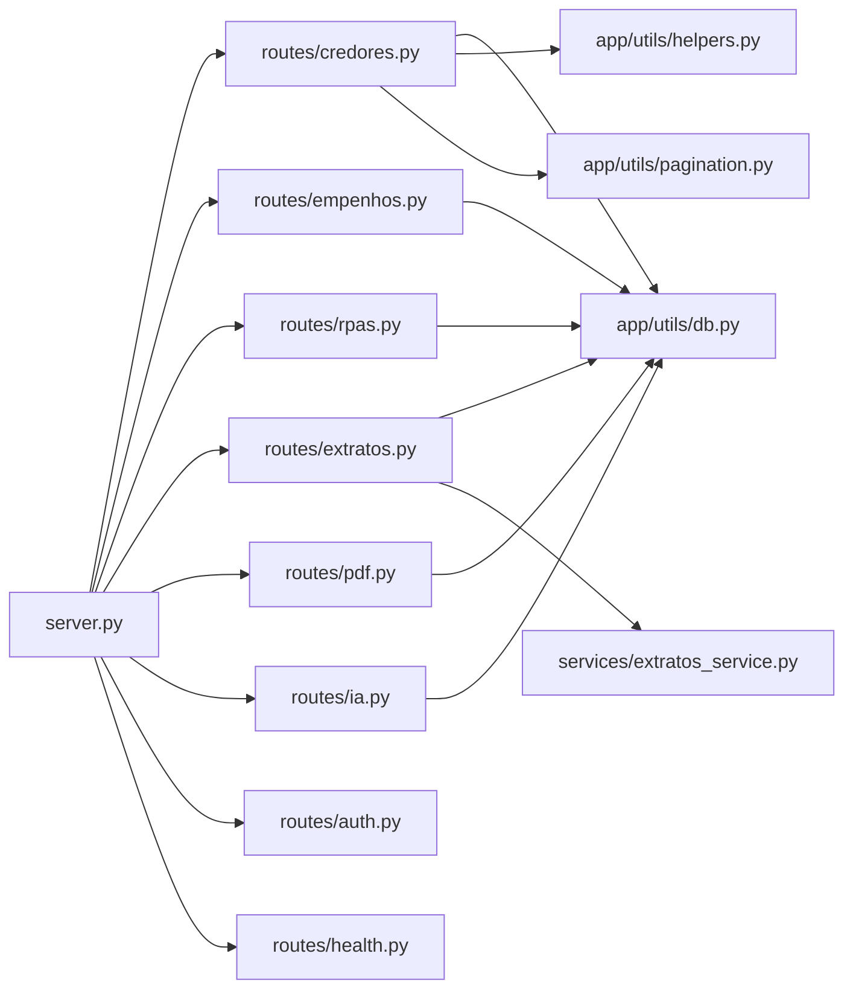

# API Reference

<cite>
**Referenced Files in This Document**
- [server.py](file://server.py)
- [config.py](file://config.py)
- [app/routes/credores.py](file://app/routes/credores.py)
- [app/routes/empenhos.py](file://app/routes/empenhos.py)
- [app/routes/rpas.py](file://app/routes/rpas.py)
- [app/routes/extratos.py](file://app/routes/extratos.py)
- [app/routes/pdf.py](file://app/routes/pdf.py)
- [app/routes/ia.py](file://app/routes/ia.py)
- [app/routes/auth.py](file://app/routes/auth.py)
- [app/routes/health.py](file://app/routes/health.py)
- [app/utils/helpers.py](file://app/utils/helpers.py)
- [app/utils/error_handlers.py](file://app/utils/error_handlers.py)
- [app/utils/db.py](file://app/utils/db.py)
- [app/utils/pagination.py](file://app/utils/pagination.py)
- [services/extratos_service.py](file://services/extratos_service.py)
- [migrations/versions/7efb54210000_initial_complete_schema_with_constraints.py](file://migrations/versions/7efb54210000_initial_complete_schema_with_constraints.py)
</cite>

## Table of Contents
1. [Introduction](#introduction)
2. [Project Structure](#project-structure)
3. [Core Components](#core-components)
4. [Architecture Overview](#architecture-overview)
5. [Detailed Component Analysis](#detailed-component-analysis)
6. [Dependency Analysis](#dependency-analysis)
7. [Performance Considerations](#performance-considerations)
8. [Troubleshooting Guide](#troubleshooting-guide)
9. [Conclusion](#conclusion)
10. [Appendices](#appendices)

## Introduction
This document provides comprehensive API documentation for the municipal financial management system. It covers REST endpoints for creditor management, expense order processing, RPA management, bank statement organization, PDF manipulation, and AI services. For each endpoint, you will find HTTP methods, URL patterns, request/response schemas, authentication requirements, parameters, and error handling. It also includes operational guidance on rate limiting, health checks, and integration best practices.

## Project Structure
The API is implemented as a Flask application with modular blueprints under app/routes/. Shared utilities reside in app/utils/, while business logic for extratos is in services/. The server initializes the database schema and static caching.

**Diagram sources**
- [server.py:113-421](file://server.py#L113-L421)
- [app/routes/credores.py:17](file://app/routes/credores.py#L17)
- [app/routes/empenhos.py:9](file://app/routes/empenhos.py#L9)
- [app/routes/rpas.py:9](file://app/routes/rpas.py#L9)
- [app/routes/extratos.py:11](file://app/routes/extratos.py#L11)
- [app/routes/pdf.py:10](file://app/routes/pdf.py#L10)
- [app/routes/ia.py:9](file://app/routes/ia.py#L9)
- [app/utils/db.py:17-77](file://app/utils/db.py#L17-L77)

**Section sources**
- [server.py:113-421](file://server.py#L113-L421)
- [app/utils/db.py:17-77](file://app/utils/db.py#L17-L77)

## Core Components
- Authentication: Administrative area authentication with rate limiting and session tokens.
- Creditor Management: CRUD operations for creditors with advanced filtering and summary.
- Expense Orders: Toggle and batch creation of monthly expense orders.
- RPA Management: Full lifecycle for RPA records.
- Bank Statement Organization: AI-powered and local organization of bank statements.
- PDF Manipulation: Merge, split, and password-protect PDFs.
- AI Services: Model listing, chat completion, and statement organization via AI.
- Health Checks: System readiness, liveness, and metrics endpoints.

**Section sources**
- [app/routes/auth.py:32-80](file://app/routes/auth.py#L32-L80)
- [app/routes/credores.py:25-225](file://app/routes/credores.py#L25-L225)
- [app/routes/empenhos.py:12-123](file://app/routes/empenhos.py#L12-L123)
- [app/routes/rpas.py:12-131](file://app/routes/rpas.py#L12-L131)
- [app/routes/extratos.py:14-131](file://app/routes/extratos.py#L14-L131)
- [app/routes/pdf.py:13-117](file://app/routes/pdf.py#L13-L117)
- [app/routes/ia.py:12-125](file://app/routes/ia.py#L12-L125)
- [app/routes/health.py:17-217](file://app/routes/health.py#L17-L217)

## Architecture Overview
The API follows a layered architecture:
- Entry point: server.py creates the Flask app, initializes the database, and registers blueprints.
- Routing: Modular blueprints define endpoints grouped by domain.
- Utilities: Helpers for validation, pagination, rate limiting, and DB connections.
- Services: Orchestration for extratos processing and AI integrations.
- Persistence: SQLite with optimized PRAGMAs and indexes.

**Diagram sources**
- [server.py:113-421](file://server.py#L113-L421)
- [app/utils/db.py:17-77](file://app/utils/db.py#L17-L77)
- [app/utils/helpers.py:134-283](file://app/utils/helpers.py#L134-L283)
- [app/utils/pagination.py:5-46](file://app/utils/pagination.py#L5-L46)

## Detailed Component Analysis

### Authentication API
- Purpose: Admin authentication, verification, and logout.
- Base URL: /api/auth
- Authentication: Session-based after successful admin authentication.

Endpoints
- POST /api/auth/adm
  - Description: Authenticate administrative user.
  - Rate Limit: Max 5 attempts per minute per IP.
  - Request JSON:
    - senha (string, required)
  - Responses:
    - 200 OK: {"ok": true}
    - 400 Bad Request: Missing fields.
    - 401 Unauthorized: Incorrect password.
    - 429 Too Many Requests: Rate limit exceeded.
    - 500 Internal Server Error: Unexpected error.
  - Notes: On success, sets session flags and generates a temporary admin token.

- GET /api/auth/verificar
  - Description: Verify current admin session.
  - Responses:
    - 200 OK: {"autenticado": true/false}

- POST /api/auth/sair
  - Description: Clear admin session.
  - Responses:
    - 200 OK: {"ok": true}

Security and Rate Limiting
- Uses SHA-256 hashing and HMAC comparison to prevent timing attacks.
- Rate limiting enforced via memory-based buckets keyed by IP.

**Section sources**
- [app/routes/auth.py:32-80](file://app/routes/auth.py#L32-L80)
- [app/utils/helpers.py:121-131](file://app/utils/helpers.py#L121-L131)

### Creditor Management API
- Purpose: Manage creditors with filtering, sorting, pagination, and optional summary statistics.
- Base URL: /api/credores

Endpoints
- GET /api/credores
  - Description: List creditors with filters and optional summary.
  - Query Parameters:
    - limit (integer, default 50, min 1, max 1000)
    - offset (integer, default 0)
    - sort_col (string, default departamento; options: nome, departamento, valor, tipo, tipo_valor, validade)
    - sort_dir (string, default asc; options: asc, desc)
    - include_summary (boolean-like string; when truthy, returns summary)
    - Filters (optional):
      - search (string)
      - departamento (string)
      - tipo (string; accepts VARIAVEL)
      - status_cadastro (string; values: sem_cnpj, sem_email, com_pendencias)
      - somente_vencidos (boolean-like)
      - vencendo_dias (integer)
      - status (string; values: empenhado, pendente) combined with:
        - ano (integer)
        - mes (integer)
  - Responses:
    - 200 OK: Paginated JSON with items and metadata; optionally includes summary.
    - 500 Internal Server Error: Unexpected error.

- POST /api/credores
  - Description: Create a new creditor.
  - Request JSON:
    - Fields validated by payload helper:
      - nome (string, required, min length 3)
      - descricao (string)
      - departamento (string)
      - tipo_valor (string, default FIXO; values: FIXO, VARIÁVEL)
      - valor (number, >= 0)
      - cnpj (string; validates format)
      - email (string; validates format)
      - pagamento (string; digits only)
      - solicitacao (string)
      - validade (string; YYYY-MM-DD)
      - obs (string)
  - Responses:
    - 201 Created: New creditor record.
    - 400 Bad Request: Validation errors.
    - 409 Conflict: Duplicate active CNPJ.
    - 500 Internal Server Error: Unexpected error.

- PUT /api/credores/:cid
  - Description: Update an existing creditor.
  - Path Parameter:
    - cid (integer, creditor ID)
  - Request JSON: Same as create, but fields are optional (partial update).
  - Responses:
    - 200 OK: Updated creditor.
    - 400 Bad Request: Validation errors.
    - 404 Not Found: Creditor not found.
    - 409 Conflict: Duplicate CNPJ (excluding self).
    - 500 Internal Server Error: Unexpected error.

- DELETE /api/credores/:cid
  - Description: Soft delete a creditor (sets ativo=0).
  - Responses:
    - 200 OK: {"ok": true}
    - 404 Not Found: Creditor not found.
    - 500 Internal Server Error: Unexpected error.

- GET /api/credores/:cid/historico
  - Description: Retrieve historical expense orders for a creditor.
  - Responses:
    - 200 OK: Array of expense order records.
    - 500 Internal Server Error: Unexpected error.

Validation and Filtering Details
- Payload validation enforces field formats and ranges.
- Filters support complex combinations including existence checks against expense orders for a given month/year.

**Section sources**
- [app/routes/credores.py:25-225](file://app/routes/credores.py#L25-L225)
- [app/utils/helpers.py:134-283](file://app/utils/helpers.py#L134-L283)
- [app/utils/pagination.py:5-46](file://app/utils/pagination.py#L5-L46)

### Expense Order Processing API
- Purpose: Toggle individual expense orders and batch-create them for multiple creditors.
- Base URL: /api/empenhos

Endpoints
- GET /api/empenhos/:ano/:mes
  - Description: List expense orders for a specific month/year, joined with creditor details.
  - Path Parameters:
    - ano (integer)
    - mes (integer)
  - Responses:
    - 200 OK: Array of expense order records with creditor info.
    - 500 Internal Server Error: Unexpected error.

- POST /api/empenhos
  - Description: Toggle an expense order for a creditor in a given month/year.
  - Request JSON:
    - credor_id (integer, required)
    - ano (integer, required)
    - mes (integer, required)
  - Responses:
    - 200 OK: {"ok": true, "action": "created"|"removed"}
    - 400 Bad Request: Missing fields.
    - 500 Internal Server Error: Unexpected error.

- POST /api/empenhos/lote
  - Description: Batch-create expense orders for multiple creditors.
  - Request JSON:
    - credores_ids (array of integers, required)
    - ano (integer, required)
    - mes (integer, required)
  - Responses:
    - 200 OK: {"ok": true, "count": number}
    - 400 Bad Request: Missing fields.
    - 500 Internal Server Error: Unexpected error.

Notes
- Toggling removes an existing order or inserts a new one.
- Logs are written for create/remove actions.

**Section sources**
- [app/routes/empenhos.py:12-123](file://app/routes/empenhos.py#L12-L123)

### RPA Management API
- Purpose: Full lifecycle management of RPA records.
- Base URL: /api/rpas

Endpoints
- GET /api/rpas
  - Description: List all RPAs ordered by creation date.
  - Responses:
    - 200 OK: Array of RPA records.
    - 500 Internal Server Error: Unexpected error.

- POST /api/rpas
  - Description: Create a new RPA.
  - Request JSON: All numeric fields default to 0 if omitted.
    - numero_rpa (string)
    - nome_prestador (string, required)
    - cpf_prestador (string)
    - endereco_prestador (string)
    - descricao_servico (string)
    - periodo_referencia (string)
    - carga_horaria (string)
    - local_execucao (string)
    - valor_bruto (number)
    - num_dependentes (integer)
    - pensao_alimenticia (number)
    - inss (number)
    - iss (number)
    - deducao_dependentes (number)
    - base_calculo_irrf (number)
    - aliquota_irrf (number)
    - parcela_deduzir_irrf (number)
    - ir (number)
    - valor_liquido (number)
    - observacoes (string)
    - data_emissao (string)
  - Responses:
    - 201 Created: New RPA record.
    - 500 Internal Server Error: Unexpected error.

- PUT /api/rpas/:rid
  - Description: Update an existing RPA.
  - Path Parameter:
    - rid (integer, RPA ID)
  - Request JSON: Fields are optional (partial update).
  - Responses:
    - 200 OK: Updated RPA record.
    - 404 Not Found: RPA not found.
    - 500 Internal Server Error: Unexpected error.

- DELETE /api/rpas/:rid
  - Description: Delete an RPA.
  - Responses:
    - 200 OK: {"ok": true}
    - 404 Not Found: RPA not found.
    - 500 Internal Server Error: Unexpected error.

**Section sources**
- [app/routes/rpas.py:12-131](file://app/routes/rpas.py#L12-L131)

### Bank Statement Organization API
- Purpose: List AI models, validate folder structure, and organize bank statements.
- Base URL: /api/extratos

Endpoints
- GET/POST /api/extratos/modelos-openrouter
  - Description: List free OpenRouter models; supports API key and model overrides via request or DB configuration.
  - Query/Body Parameters:
    - api_key (string; optional override)
    - model (string; optional override)
  - Responses:
    - 200 OK: {"modelos": [...], "models": [...], "selected_model": "..."}
    - 400 Bad Request: Missing API key.
    - 500 Internal Server Error: Unexpected error.

- GET /api/extratos/subpastas
  - Description: List subfolders under the configured extratos directory.
  - Responses:
    - 200 OK: Array of folder entries.
    - 500 Internal Server Error: Unexpected error.

- POST /api/extratos/validar
  - Description: Validate origin and destination folders.
  - Request JSON:
    - origem (string, required)
    - destino (string, required)
  - Responses:
    - 200 OK: Validation result (null if valid, error message otherwise).
    - 500 Internal Server Error: Unexpected error.

- POST /api/extratos/processar
  - Description: Process bank statements using AI or local logic.
  - Request JSON:
    - origem (string, required)
    - destino (string, required)
    - modelo (string; optional)
    - dry_run (boolean; optional)
  - Responses:
    - 200 OK: Processing summary with counts and results.
    - 500 Internal Server Error: Unexpected error.

AI and Organization Logic
- Uses services/extratos_service.py to orchestrate processing and adapt results.
- Supports AI-powered organization when API key is configured.

**Section sources**
- [app/routes/extratos.py:14-131](file://app/routes/extratos.py#L14-L131)
- [services/extratos_service.py:51-83](file://services/extratos_service.py#L51-L83)

### PDF Manipulation API
- Purpose: Merge, split, and protect PDFs.
- Base URL: /api/pdf

Endpoints
- POST /api/pdf/mesclar
  - Description: Merge multiple PDFs into one.
  - Form Data:
    - files (multiple files; minimum 2)
  - Responses:
    - 200 OK: Single merged PDF as attachment.
    - 400 Bad Request: Missing files or insufficient files.
    - 500 Internal Server Error: Unexpected error.

- POST /api/pdf/dividir
  - Description: Split a single PDF into individual pages.
  - Form Data:
    - file (single PDF)
  - Responses:
    - 200 OK: {"ok": true, "total": number, "message": "..."}
    - 400 Bad Request: Missing file or single-page PDF.
    - 500 Internal Server Error: Unexpected error.

- POST /api/pdf/proteger
  - Description: Encrypt a PDF with a password.
  - Form Data:
    - file (single PDF)
    - senha (string, required)
  - Responses:
    - 200 OK: Protected PDF as attachment.
    - 400 Bad Request: Missing file or password.
    - 500 Internal Server Error: Unexpected error.

**Section sources**
- [app/routes/pdf.py:13-117](file://app/routes/pdf.py#L13-L117)

### AI Services API
- Purpose: List available AI models, chat with AI, and organize statements using AI.
- Base URL: /api/ia

Endpoints
- GET /api/ia/modelos
  - Description: List available AI models using stored API key.
  - Responses:
    - 200 OK: {"ok": true, "modelos": [...]}
    - 400 Bad Request: Missing API key.
    - 500 Internal Server Error: Unexpected error.

- POST /api/ia/chat
  - Description: Chat with AI using a system message and user message.
  - Request JSON:
    - mensagem (string, required)
    - modelo (string; optional; falls back to configured default)
    - sistema (string; optional system role content)
  - Responses:
    - 200 OK: {"ok": true, "resposta": "..."}
    - 400 Bad Request: Missing message or API key.
    - 500 Internal Server Error: Unexpected error.

- POST /api/ia/organizar-extratos
  - Description: Organize bank statement text using AI.
  - Request JSON:
    - texto (string, required)
  - Responses:
    - 200 OK: {"ok": true, "resposta": "..."}
    - 400 Bad Request: Missing text or API key.
    - 500 Internal Server Error: Unexpected error.

Integration Notes
- Uses OpenRouter service; model defaults are configurable via settings and DB.

**Section sources**
- [app/routes/ia.py:12-125](file://app/routes/ia.py#L12-L125)
- [config.py:40-61](file://config.py#L40-L61)

### Health and Metrics API
- Purpose: System health, readiness, liveness, and basic metrics.
- Base URL: /api/health

Endpoints
- GET /api/health
  - Description: General health status including database connectivity and counts.
  - Responses:
    - 200 OK: Healthy status with timestamp and counts.
    - 503 Service Unavailable: Database or structural issues.

- GET /api/health/ready
  - Description: Readiness probe verifying required tables and basic queries.
  - Responses:
    - 200 OK: Ready with table list.
    - 503 Service Unavailable: Missing tables or query failures.

- GET /api/health/live
  - Description: Liveness probe returning alive status.
  - Responses:
    - 200 OK: Alive status.

- GET /api/health/metrics
  - Description: Basic system statistics and database size.
  - Responses:
    - 200 OK: Metrics including counts and sizes.
    - 503 Service Unavailable: Metrics collection failure.

**Section sources**
- [app/routes/health.py:17-217](file://app/routes/health.py#L17-L217)

## Dependency Analysis
Key dependencies and relationships:
- server.py initializes the Flask app, DB, and registers blueprints.
- app/utils/db.py manages SQLite connections and PRAGMAs.
- app/utils/helpers.py provides validation, rate limiting, and payload normalization.
- app/utils/pagination.py standardizes paginated responses.
- services/extratos_service.py orchestrates extratos processing.
- app/routes/* depend on utilities and DB for data access.

**Diagram sources**
- [server.py:113-421](file://server.py#L113-L421)
- [app/utils/db.py:17-77](file://app/utils/db.py#L17-L77)
- [app/utils/helpers.py:134-283](file://app/utils/helpers.py#L134-L283)
- [app/utils/pagination.py:5-46](file://app/utils/pagination.py#L5-L46)
- [services/extratos_service.py:51-83](file://services/extratos_service.py#L51-L83)
- [app/routes/credores.py:25-225](file://app/routes/credores.py#L25-L225)
- [app/routes/empenhos.py:12-123](file://app/routes/empenhos.py#L12-L123)
- [app/routes/rpas.py:12-131](file://app/routes/rpas.py#L12-L131)
- [app/routes/extratos.py:14-131](file://app/routes/extratos.py#L14-L131)
- [app/routes/pdf.py:13-117](file://app/routes/pdf.py#L13-L117)
- [app/routes/ia.py:12-125](file://app/routes/ia.py#L12-L125)
- [app/routes/auth.py:32-80](file://app/routes/auth.py#L32-L80)
- [app/routes/health.py:17-217](file://app/routes/health.py#L17-L217)

**Section sources**
- [server.py:113-421](file://server.py#L113-L421)
- [app/utils/db.py:17-77](file://app/utils/db.py#L17-L77)
- [app/utils/helpers.py:134-283](file://app/utils/helpers.py#L134-L283)
- [app/utils/pagination.py:5-46](file://app/utils/pagination.py#L5-L46)
- [services/extratos_service.py:51-83](file://services/extratos_service.py#L51-L83)

## Performance Considerations
- Database Optimizations:
  - SQLite PRAGMAs applied for concurrency and performance.
  - Indexes created on frequently queried columns (e.g., credor_id, ano, mes).
- Static File Serving:
  - Preloaded static assets with gzip/brotli compression and ETag caching.
- Pagination:
  - Consistent pagination wrapper ensures predictable response sizes.
- Rate Limiting:
  - Memory-based rate limiter prevents abuse on sensitive endpoints (e.g., auth).

[No sources needed since this section provides general guidance]

## Troubleshooting Guide
Common issues and resolutions:
- Authentication Failures:
  - Ensure admin password matches the configured secret and that rate limits are not triggered.
- Validation Errors:
  - Review payload fields for required values, formats, and ranges.
- Database Connectivity:
  - Use /api/health endpoints to verify database connection and schema readiness.
- AI Service Errors:
  - Confirm API keys and model configurations are set; check external service availability.

Error Handling
- Global error handlers standardize error responses with consistent JSON bodies and appropriate HTTP status codes.

**Section sources**
- [app/utils/error_handlers.py:9-145](file://app/utils/error_handlers.py#L9-L145)
- [app/routes/health.py:17-217](file://app/routes/health.py#L17-L217)

## Conclusion
This API provides a robust foundation for managing municipal finances, including creditor administration, expense orders, RPA records, statement organization, PDF operations, and AI-driven assistance. The documented endpoints, parameters, and responses enable reliable client integration, while built-in health checks, rate limiting, and standardized error handling improve reliability and security.

[No sources needed since this section summarizes without analyzing specific files]

## Appendices

### Authentication Mechanisms
- Admin authentication requires a secure password check and stores a session flag and token.
- Subsequent admin endpoints require an active session.

**Section sources**
- [app/routes/auth.py:32-80](file://app/routes/auth.py#L32-L80)

### CORS Policies
- No explicit CORS configuration was identified in the analyzed files. Clients should configure CORS appropriately when accessing the API cross-origin.

[No sources needed since this section does not analyze specific files]

### Security Measures
- Secure password hashing and HMAC comparisons mitigate timing attacks.
- Rate limiting protects sensitive endpoints.
- Session-based admin authentication controls access to administrative flows.

**Section sources**
- [app/routes/auth.py:27-64](file://app/routes/auth.py#L27-L64)
- [app/utils/helpers.py:121-131](file://app/utils/helpers.py#L121-L131)

### Client Implementation Guidelines
- Use HTTPS in production.
- Implement retry with exponential backoff for transient failures.
- Respect rate limits and handle 429 responses gracefully.
- Cache static assets locally and leverage ETags for conditional requests.
- Validate responses against documented schemas before processing.

[No sources needed since this section provides general guidance]

### Database Schema Notes
- Initial schema and indexes are created during server initialization.
- Alembic migration registers the baseline for future migrations.

**Section sources**
- [server.py:192-282](file://server.py#L192-L282)
- [migrations/versions/7efb54210000_initial_complete_schema_with_constraints.py:26-53](file://migrations/versions/7efb54210000_initial_complete_schema_with_constraints.py#L26-L53)