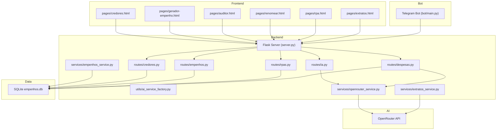
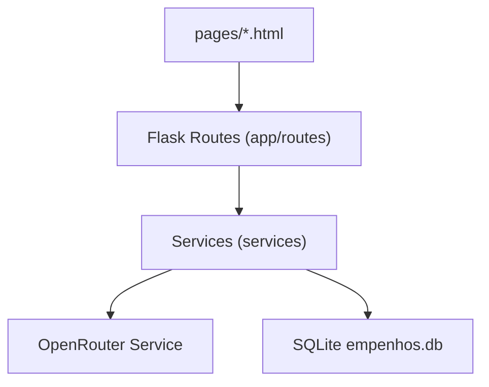
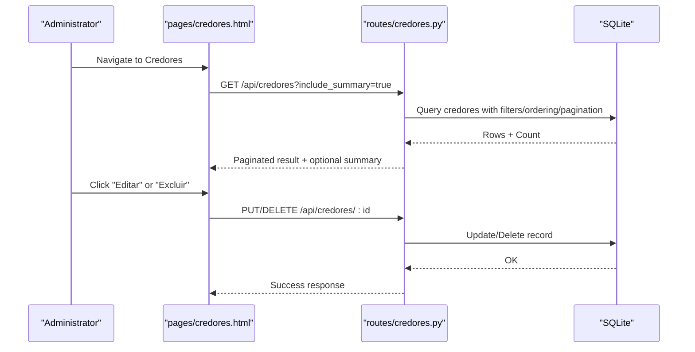
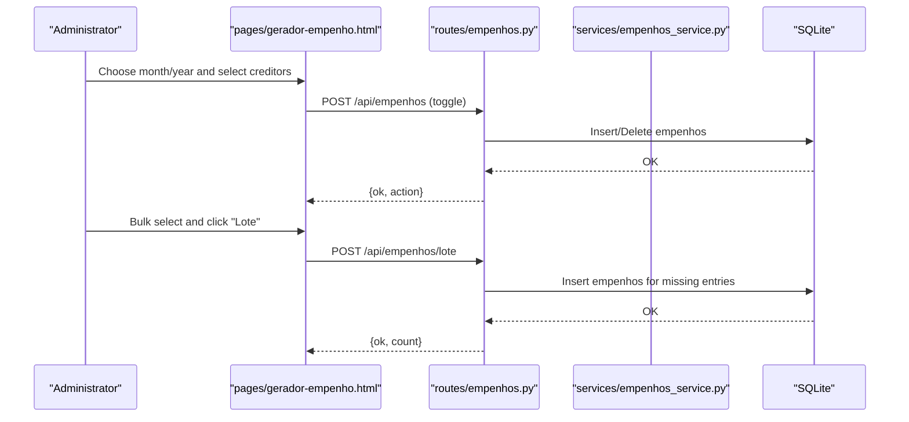
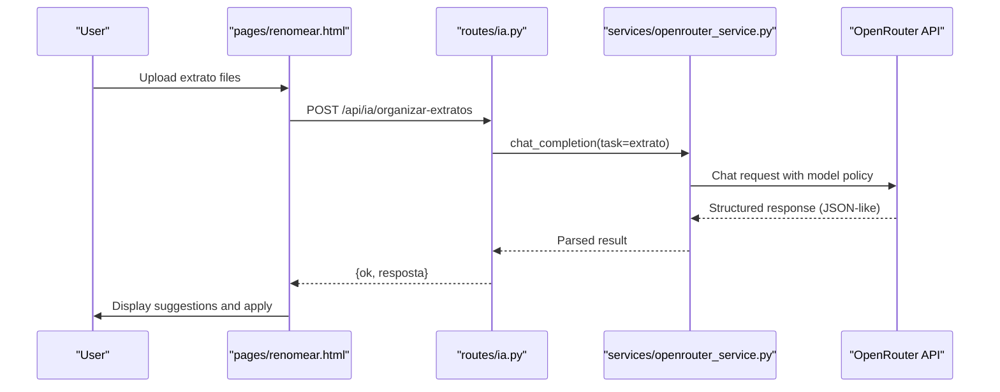
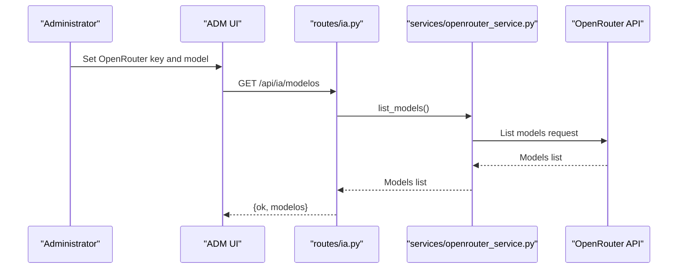
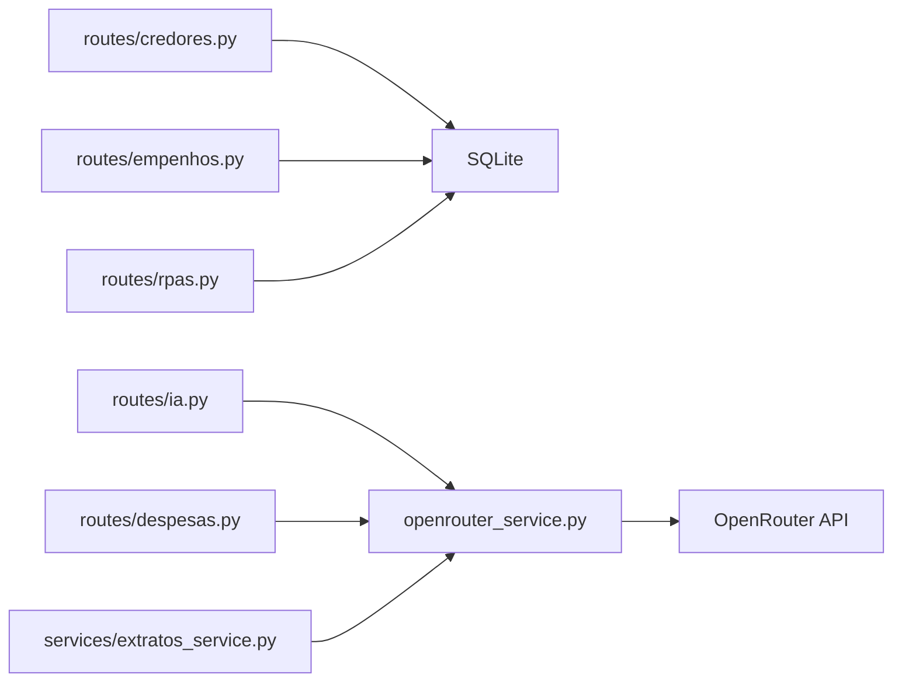

# Core Features

<cite>
**Referenced Files in This Document**
- [README.md](file://README.md)
- [MANUAL_DO_PROJETO.md](file://MANUAL_DO_PROJETO.md)
- [server.py](file://server.py)
- [config.py](file://config.py)
- [app/routes/credores.py](file://app/routes/credores.py)
- [app/routes/empenhos.py](file://app/routes/empenhos.py)
- [app/routes/rpas.py](file://app/routes/rpas.py)
- [app/routes/ia.py](file://app/routes/ia.py)
- [app/routes/despesas.py](file://app/routes/despesas.py)
- [services/empenhos_service.py](file://services/empenhos_service.py)
- [services/extratos_service.py](file://services/extratos_service.py)
- [services/openrouter_service.py](file://services/openrouter_service.py)
- [app/utils/ai_service_factory.py](file://app/utils/ai_service_factory.py)
- [pages/gerador-empenho.html](file://pages/gerador-empenho.html)
- [pages/auditor.html](file://pages/auditor.html)
- [pages/renomear.html](file://pages/renomear.html)
- [bot/main.py](file://bot/main.py)
</cite>

## Table of Contents
1. [Introduction](#introduction)
2. [Project Structure](#project-structure)
3. [Core Components](#core-components)
4. [Architecture Overview](#architecture-overview)
5. [Detailed Component Analysis](#detailed-component-analysis)
6. [Dependency Analysis](#dependency-analysis)
7. [Performance Considerations](#performance-considerations)
8. [Troubleshooting Guide](#troubleshooting-guide)
9. [Conclusion](#conclusion)
10. [Appendices](#appendices)

## Introduction
This document explains the core features of the municipal financial management system for the Prefeitura Municipal de Inajá. It focuses on four primary functional areas:
- Creditor management system
- Monthly expense order processing
- AI-powered document organization
- Administrative workflow tools

It describes how each feature addresses specific municipal financial needs, their interconnections, user workflows, capabilities, business value, integration patterns, and practical examples. Both operational aspects for administrators and technical implementation details for developers are covered.

## Project Structure
The system is a local Flask web application with a SQLite database, complemented by AI integrations via OpenRouter and a Telegram bot for notifications and remote access. Key folders and files:
- Backend API: Flask routes under app/routes/, services under services/, utilities under app/utils/
- AI orchestration: OpenRouter integration and caching under services/openrouter_service.py
- Frontend modules: HTML pages under pages/ for each module
- AI document processors: renomer/ folder for extrato organization and file renaming
- Bot: Telegram bot under bot/ for notifications and tunnel access sharing
- Database: empenhos.db initialized automatically by server.py

**Diagram sources**
- [server.py](file://server.py)
- [app/routes/credores.py](file://app/routes/credores.py)
- [app/routes/empenhos.py](file://app/routes/empenhos.py)
- [app/routes/rpas.py](file://app/routes/rpas.py)
- [app/routes/ia.py](file://app/routes/ia.py)
- [app/routes/despesas.py](file://app/routes/despesas.py)
- [services/openrouter_service.py](file://services/openrouter_service.py)
- [services/extratos_service.py](file://services/extratos_service.py)
- [services/empenhos_service.py](file://services/empenhos_service.py)
- [pages/gerador-empenho.html](file://pages/gerador-empenho.html)
- [pages/auditor.html](file://pages/auditor.html)
- [pages/renomear.html](file://pages/renomear.html)
- [bot/main.py](file://bot/main.py)

**Section sources**
- [README.md:37-79](file://README.md#L37-L79)
- [MANUAL_DO_PROJETO.md:125-176](file://MANUAL_DO_PROJETO.md#L125-L176)

## Core Components
- Creditor management system: CRUD for creditors, filtering, sorting, pagination, historical audit, soft deletion, and summary statistics.
- Monthly expense order processing: toggle monthly expense orders per creditor, batch operations, and audit logging.
- AI-powered document organization: OCR extraction, AI-driven categorization and filename generation for bank statements and documents, with fallbacks and caching.
- Administrative workflow tools: Telegram bot for notifications and temporary public access sharing, plus ADM area for API keys and model selection.

**Section sources**
- [app/routes/credores.py:25-225](file://app/routes/credores.py#L25-L225)
- [app/routes/empenhos.py:12-123](file://app/routes/empenhos.py#L12-L123)
- [services/extratos_service.py:51-83](file://services/extratos_service.py#L51-L83)
- [services/openrouter_service.py:72-136](file://services/openrouter_service.py#L72-L136)
- [bot/main.py:84-117](file://bot/main.py#L84-L117)

## Architecture Overview
The system follows a layered architecture:
- Presentation: Static HTML pages under pages/ with embedded JavaScript for client-side interactions and API calls.
- API: Flask routes expose REST endpoints for creditors, empenhos, RPA, IA, and despesas.
- Services: Business logic and integrations (OpenRouter, file processing).
- Data: SQLite database with optimized indices and constraints.
- AI: OpenRouter integration with TTL cache, rate-limit handling, and model policies.
- Bot: Telegram bot for operational notifications and tunnel URL sharing.

**Diagram sources**
- [server.py](file://server.py)
- [app/routes/ia.py](file://app/routes/ia.py)
- [services/openrouter_service.py](file://services/openrouter_service.py)
- [services/extratos_service.py](file://services/extratos_service.py)

## Detailed Component Analysis

### Creditor Management System
- Purpose: Manage recurring creditors and monthly expense orders.
- Capabilities:
  - Create, update, list, and soft-delete creditors.
  - Filter by department and status, sort by multiple fields, paginate results.
  - Optional summary statistics (fixed/variable, missing CNPJ/email, expiring/expired).
  - Historical view of a creditor’s empenhos.
- Business value:
  - Reduces administrative overhead by centralizing creditor data.
  - Improves transparency and auditability with summaries and logs.
- Operational workflow:
  - Add/update creditor details (name, department, value, contact info).
  - Use filters/sorting to locate creditors quickly.
  - Generate reports and export data.
- Technical implementation highlights:
  - Route-level filtering and ordering with dynamic SQL.
  - Soft delete pattern to preserve history.
  - Audit logging on create/update/delete.

**Diagram sources**
- [app/routes/credores.py:25-91](file://app/routes/credores.py#L25-L91)
- [app/routes/credores.py:143-206](file://app/routes/credores.py#L143-L206)

**Section sources**
- [app/routes/credores.py:25-91](file://app/routes/credores.py#L25-L91)
- [app/routes/credores.py:209-225](file://app/routes/credores.py#L209-L225)

### Monthly Expense Order Processing
- Purpose: Toggle monthly expense orders for creditors and manage bulk actions.
- Capabilities:
  - Toggle a single empenho (create/remove) for a given creditor and month/year.
  - Batch creation of empenhos for multiple creditors.
  - Retrieve empenhos for a specific month/year with creditor details.
- Business value:
  - Streamlines monthly budget execution and reduces manual effort.
  - Ensures consistent audit trail with logs.
- Operational workflow:
  - Select a month/year and mark empenhos for creditors.
  - Use batch mode for quick updates across departments.
- Technical implementation highlights:
  - Upsert logic with toggle semantics.
  - Audit logging for create/remove and batch operations.

**Diagram sources**
- [app/routes/empenhos.py:31-82](file://app/routes/empenhos.py#L31-L82)
- [app/routes/empenhos.py:84-123](file://app/routes/empenhos.py#L84-L123)
- [services/empenhos_service.py:9-36](file://services/empenhos_service.py#L9-L36)

**Section sources**
- [app/routes/empenhos.py:12-28](file://app/routes/empenhos.py#L12-L28)
- [app/routes/empenhos.py:31-82](file://app/routes/empenhos.py#L31-L82)
- [app/routes/empenhos.py:84-123](file://app/routes/empenhos.py#L84-L123)
- [services/empenhos_service.py:9-36](file://services/empenhos_service.py#L9-L36)

### AI-Powered Document Organization
- Purpose: Automatically organize bank statements and rename documents using AI.
- Capabilities:
  - Extract text from PDFs/images (OCR).
  - AI categorization and filename generation for extratos.
  - Fallback detection for missing fields.
  - Preview and apply organization results.
  - Cache and retry strategies for cost control.
- Business value:
  - Reduces manual classification time and improves consistency.
  - Minimizes human errors through structured naming and categorization.
- Operational workflow:
  - Upload extrato files (PDF/OFX) or enable OCR for images.
  - Review suggested filenames and categories.
  - Apply changes to organize documents.
- Technical implementation highlights:
  - OpenRouterService with TTL cache, rate-limit handling, and model policies.
  - OrganizadorIA orchestrates OCR + AI parsing with fallbacks.
  - Frontend pages for auditor, renomear, and empenho integrate with AI endpoints.

**Diagram sources**
- [pages/renomear.html:760-792](file://pages/renomear.html#L760-L792)
- [app/routes/ia.py:79-125](file://app/routes/ia.py#L79-L125)
- [services/openrouter_service.py:72-136](file://services/openrouter_service.py#L72-L136)

**Section sources**
- [services/extratos_service.py:51-83](file://services/extratos_service.py#L51-L83)
- [services/openrouter_service.py:311-320](file://services/openrouter_service.py#L311-L320)
- [pages/renomear.html:760-792](file://pages/renomear.html#L760-L792)

### Administrative Workflow Tools
- Purpose: Provide operational controls and integrations for administrators.
- Capabilities:
  - Configure OpenRouter API key and model selection.
  - Test connectivity to external APIs.
  - View system logs.
  - Manage admin password.
  - Telegram bot notifications and temporary public access sharing.
- Business value:
  - Ensures secure and reliable operation of AI features.
  - Enables remote monitoring and quick access to the system.
- Operational workflow:
  - Access ADM area to configure keys and models.
  - Monitor logs and adjust settings as needed.
  - Share tunnel URL via Telegram for emergency access.
- Technical implementation highlights:
  - AI service factory centralizes configuration retrieval and service building.
  - Bot initializes and sends tunnel URL to configured Telegram chats.

**Diagram sources**
- [app/routes/ia.py:12-29](file://app/routes/ia.py#L12-L29)
- [services/openrouter_service.py:137-147](file://services/openrouter_service.py#L137-L147)

**Section sources**
- [app/utils/ai_service_factory.py:9-58](file://app/utils/ai_service_factory.py#L9-L58)
- [bot/main.py:84-117](file://bot/main.py#L84-L117)

## Dependency Analysis
- Internal dependencies:
  - routes depend on app/utils/db and helpers; they also use audit logging.
  - services encapsulate AI and file-processing logic and are reused by routes.
- External dependencies:
  - OpenRouter for AI inference with robust error handling and caching.
  - PDF.js and Tesseract.js for client-side OCR and PDF rendering.
- Data dependencies:
  - SQLite with foreign keys and constraints; optimized indices for frequent queries.

**Diagram sources**
- [app/routes/credores.py:5-15](file://app/routes/credores.py#L5-L15)
- [app/routes/empenhos.py:5-8](file://app/routes/empenhos.py#L5-L8)
- [app/routes/rpas.py:5-8](file://app/routes/rpas.py#L5-L8)
- [app/routes/ia.py:5-8](file://app/routes/ia.py#L5-L8)
- [app/routes/despesas.py:8-12](file://app/routes/despesas.py#L8-L12)
- [services/extratos_service.py:5-7](file://services/extratos_service.py#L5-L7)
- [services/openrouter_service.py:72-88](file://services/openrouter_service.py#L72-L88)

**Section sources**
- [README.md:83-106](file://README.md#L83-L106)
- [MANUAL_DO_PROJETO.md:344-420](file://MANUAL_DO_PROJETO.md#L344-L420)

## Performance Considerations
- Database:
  - Optimized indices on frequently queried columns (credores, empenhos, logs, etc.).
  - Constraints and cascading deletes improve data integrity and simplify cleanup.
- AI:
  - TTL cache reduces repeated calls and costs.
  - Model policies define max input length and token limits.
  - Rate-limit handling with backoff and fallback models.
- Frontend:
  - Client-side OCR and PDF rendering reduce server load.
  - Pagination and sorting on the backend prevent large payloads.

[No sources needed since this section provides general guidance]

## Troubleshooting Guide
- OpenRouter key not configured:
  - Symptom: Errors when accessing AI endpoints.
  - Resolution: Configure key and model in ADM area or via environment variables.
- Rate limiting or timeouts:
  - Symptom: HTTP 429 or timeout responses.
  - Resolution: Wait for cooldown, switch to a free model, or reduce request frequency.
- Database connection issues:
  - Symptom: Errors on CRUD operations.
  - Resolution: Verify empenhos.db accessibility and integrity; restart server.
- Telegram bot issues:
  - Symptom: No tunnel URL or errors.
  - Resolution: Check TELEGRAM_TOKEN and target chat IDs; ensure bot initialization succeeds.

**Section sources**
- [services/openrouter_service.py:251-278](file://services/openrouter_service.py#L251-L278)
- [bot/main.py:54-72](file://bot/main.py#L54-L72)

## Conclusion
The municipal financial management system integrates creditor administration, monthly expense processing, AI-powered document organization, and administrative workflow tools into a cohesive platform. Its layered architecture, robust AI integration with caching and fallbacks, and operational tools support efficient, auditable, and scalable municipal financial operations.

## Appendices

### Practical Use Cases and Workflows
- Monthly expense execution:
  - Administrator selects month/year, toggles empenhos for creditors, and reviews audit logs.
- Document organization:
  - Upload extratos, review AI suggestions, and apply organization to folders.
- Invoice auditing:
  - Upload invoice image/PDF, run AI audit, and download risk report.
- Report generation:
  - Use creditor list with summaries and export options for management reporting.

[No sources needed since this section doesn't analyze specific files]