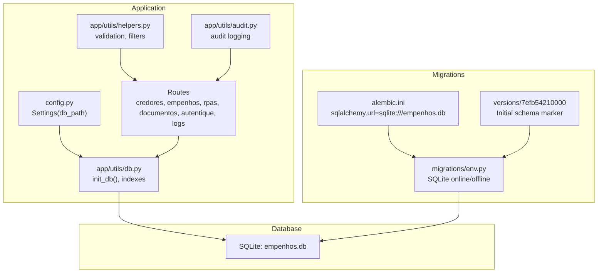
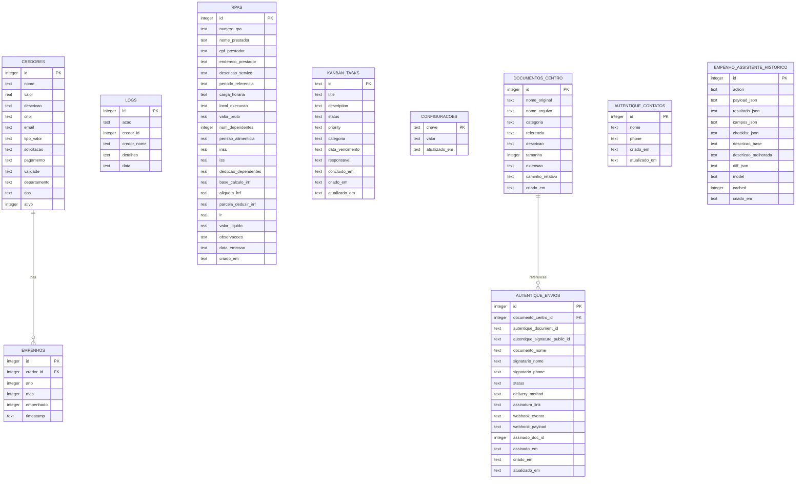
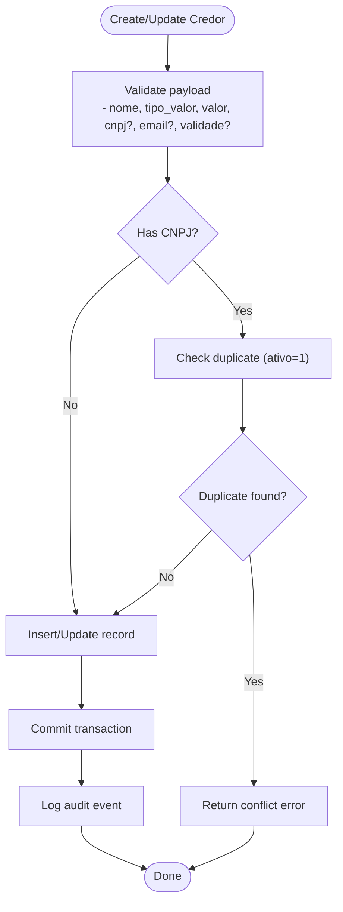
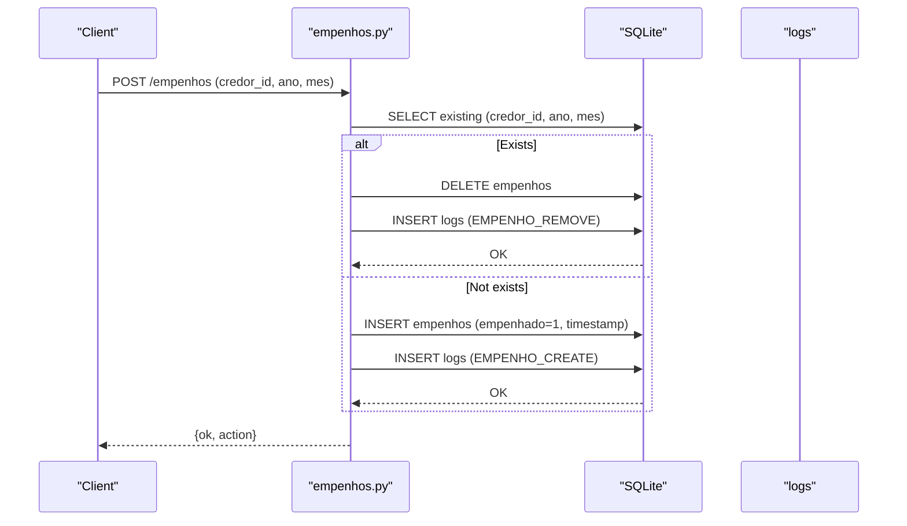
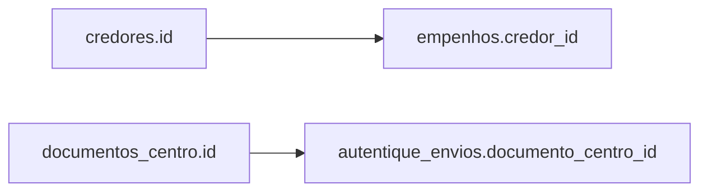

# Database Design

<cite>
**Referenced Files in This Document**
- [app/utils/db.py](file://app/utils/db.py)
- [app/routers/credores.py](file://app/routes/credores.py)
- [app/routers/empenhos.py](file://app/routes/empenhos.py)
- [app/routers/logs.py](file://app/routes/logs.py)
- [app/routers/rpas.py](file://app/routes/rpas.py)
- [app/routers/documentos.py](file://app/routes/documentos.py)
- [app/routers/autentique.py](file://app/routes/autentique.py)
- [app/utils/helpers.py](file://app/utils/helpers.py)
- [app/utils/audit.py](file://app/utils/audit.py)
- [config.py](file://config.py)
- [alembic.ini](file://alembic.ini)
- [migrations/env.py](file://migrations/env.py)
- [migrations/versions/7efb54210000_initial_complete_schema_with_constraints.py](file://migrations/versions/7efb54210000_initial_complete_schema_with_constraints.py)
- [MIGRATIONS_GUIA.md](file://MIGRATIONS_GUIA.md)
</cite>

## Table of Contents
1. [Introduction](#introduction)
2. [Project Structure](#project-structure)
3. [Core Components](#core-components)
4. [Architecture Overview](#architecture-overview)
5. [Detailed Component Analysis](#detailed-component-analysis)
6. [Dependency Analysis](#dependency-analysis)
7. [Performance Considerations](#performance-considerations)
8. [Troubleshooting Guide](#troubleshooting-guide)
9. [Conclusion](#conclusion)
10. [Appendices](#appendices)

## Introduction
This document describes the municipal financial management system database design. It covers entity relationships, table schemas, field definitions, data types, primary and foreign keys, indexes, constraints, data validation rules, business rules enforcement, referential integrity, and migration management with Alembic. It also includes schema diagrams, sample data examples, data access patterns, constraint verification procedures, performance optimization strategies, and data lifecycle considerations.

## Project Structure
The database is implemented as a SQLite file managed by a Flask application. Initialization and schema creation are handled programmatically during startup, complemented by Alembic migrations for future changes. Configuration defines the database path and runtime settings.

**Diagram sources**
- [config.py:18-64](file://config.py#L18-L64)
- [app/utils/db.py:79-270](file://app/utils/db.py#L79-L270)
- [alembic.ini:4-7](file://alembic.ini#L4-L7)
- [migrations/env.py:21-28](file://migrations/env.py#L21-L28)
- [migrations/versions/7efb54210000_initial_complete_schema_with_constraints.py:19-23](file://migrations/versions/7efb54210000_initial_complete_schema_with_constraints.py#L19-L23)

**Section sources**
- [config.py:18-64](file://config.py#L18-L64)
- [app/utils/db.py:79-270](file://app/utils/db.py#L79-L270)
- [alembic.ini:4-7](file://alembic.ini#L4-L7)
- [migrations/env.py:21-28](file://migrations/env.py#L21-L28)
- [migrations/versions/7efb54210000_initial_complete_schema_with_constraints.py:19-23](file://migrations/versions/7efb54210000_initial_complete_schema_with_constraints.py#L19-L23)

## Core Components
The system maintains a set of core tables supporting financial management:

- credores: Supplier/provider master data with contact, payment terms, validity, and classification.
- empenhos: Monthly commitment records linking to suppliers.
- logs: Audit trail for system actions.
- rpas: Receipt and Payment Authorization records for service providers.
- kanban_tasks: Task/workflow tracking.
- configuracoes: System configuration key-value storage.
- documentos_centro: Centralized document metadata and storage references.
- autentique_envios: Integrations with Autentique signature service.
- autentique_contatos: Contact book for Autentique.
- empenho_assistente_historico: AI assistant history for expense assistance.

Indexes and constraints are defined to ensure data integrity and query performance.

**Section sources**
- [app/utils/db.py:84-270](file://app/utils/db.py#L84-L270)

## Architecture Overview
The database architecture centers around supplier-centric financial workflows. Suppliers (credores) are linked to monthly commitments (empenhos). Supporting entities manage document storage, external integrations, configuration, task tracking, and audit logging.

**Diagram sources**
- [app/utils/db.py:84-245](file://app/utils/db.py#L84-L245)

## Detailed Component Analysis

### Entity: credores
- Purpose: Master data for suppliers/providers.
- Key fields: identification, contact info, classification, payment terms, validity, department, activity flag.
- Constraints: ativo flag for soft deletion; unique constraints may exist externally (see migration guide).
- Validation rules: client-side validation ensures required fields, valid CNPJ/email, numeric amounts, and date formats.
- Access patterns: filtering by department, type, search terms, and status; paginated listing; summary statistics.

**Diagram sources**
- [app/utils/helpers.py:134-208](file://app/utils/helpers.py#L134-L208)
- [app/routes/credores.py:94-141](file://app/routes/credores.py#L94-L141)
- [app/utils/audit.py:12-48](file://app/utils/audit.py#L12-L48)

**Section sources**
- [app/utils/db.py:84-101](file://app/utils/db.py#L84-L101)
- [app/utils/helpers.py:134-208](file://app/utils/helpers.py#L134-L208)
- [app/routes/credores.py:25-92](file://app/routes/credores.py#L25-L92)
- [app/utils/audit.py:12-48](file://app/utils/audit.py#L12-L48)

### Entity: empenhos
- Purpose: Monthly commitment records for suppliers.
- Key fields: references supplier, year/month, commitment flag, timestamp.
- Constraints: unique combination of supplier, year, month; foreign key to credores.
- Business rules: toggle operation removes or creates commitment; batch operations supported.
- Access patterns: list by year/month; toggle single or batch create/remove.

**Diagram sources**
- [app/routes/empenhos.py:31-81](file://app/routes/empenhos.py#L31-L81)
- [app/utils/db.py:103-115](file://app/utils/db.py#L103-L115)
- [app/utils/db.py:117-127](file://app/utils/db.py#L117-L127)

**Section sources**
- [app/utils/db.py:103-115](file://app/utils/db.py#L103-L115)
- [app/routes/empenhos.py:12-81](file://app/routes/empenhos.py#L12-L81)

### Entity: logs
- Purpose: Audit trail for system actions.
- Key fields: action type, optional credor linkage, details, timestamp.
- Access patterns: list with optional filter by action; paginated.

**Section sources**
- [app/utils/db.py:117-127](file://app/utils/db.py#L117-L127)
- [app/routes/logs.py:11-35](file://app/routes/logs.py#L11-L35)

### Entity: rpas
- Purpose: Receipt and Payment Authorization records for service providers.
- Key fields: provider info, service description, period, hours, location, financial breakdown, observations, emission date; timestamps.
- Access patterns: CRUD operations; listing ordered by creation date.

**Section sources**
- [app/utils/db.py:129-156](file://app/utils/db.py#L129-L156)
- [app/routes/rpas.py:12-131](file://app/routes/rpas.py#L12-L131)

### Supporting Entities

#### kanban_tasks
- Purpose: Task/workflow tracking with status, priority, due date, and timestamps.
- Key fields: unique textual ID, title, description, status, priority, category, due date, assignee, completion timestamp, creation/update timestamps.

**Section sources**
- [app/utils/db.py:158-173](file://app/utils/db.py#L158-L173)

#### configuracoes
- Purpose: System configuration key-value store with update timestamps.

**Section sources**
- [app/utils/db.py:175-182](file://app/utils/db.py#L175-L182)

#### documentos_centro
- Purpose: Centralized document metadata and storage path references.
- Key fields: original name, stored filename, category, reference, description, size, extension, relative path, creation timestamp.
- Access patterns: list with category filter; upload persists file and metadata; download and delete operations.

**Section sources**
- [app/utils/db.py:184-197](file://app/utils/db.py#L184-L197)
- [app/routes/documentos.py:17-121](file://app/routes/documentos.py#L17-L121)

#### autentique_envios
- Purpose: Integration with Autentique signature service; links to uploaded documents and stores signature metadata.
- Key fields: references document, Autentique document/signature IDs, signer info, status, delivery method, signature link, webhook events, timestamps.

**Section sources**
- [app/utils/db.py:200-218](file://app/utils/db.py#L200-L218)
- [app/routes/autentique.py:105-122](file://app/routes/autentique.py#L105-L122)

#### autentique_contatos
- Purpose: Contact book for Autentique; enforces unique phone normalization.
- Key fields: name, normalized phone, creation/update timestamps.

**Section sources**
- [app/utils/db.py:220-228](file://app/utils/db.py#L220-L228)
- [app/routes/autentique.py:125-194](file://app/routes/autentique.py#L125-L194)

#### empenho_assistente_historico
- Purpose: Stores AI assistant history for expense assistance with JSON payloads and diffs.
- Key fields: action, JSON fields, model info, caching flag, timestamps.

**Section sources**
- [app/utils/db.py:230-245](file://app/utils/db.py#L230-L245)

## Dependency Analysis
- Foreign keys:
  - empenhos.credor_id → credores.id
  - autentique_envios.documento_centro_id → documentos_centro.id
- Indexes:
  - empenhos: credor_id, (ano, mes), (ano, mes, empenhado), (credor_id, ano, mes)
  - credores: departamento, nome, ativo, tipo_valor, validade
  - documentos_centro: categoria, referencia, criado_em, (categoria, referencia)
  - empenho_assistente_historico: action, criado_em
- Constraints and checks:
  - Unique combinations and NOT NULL constraints are documented in the migration guide.
  - Referential integrity enforced via foreign keys; cascades may be configured per migration.

**Diagram sources**
- [app/utils/db.py:103-115](file://app/utils/db.py#L103-L115)
- [app/utils/db.py:200-218](file://app/utils/db.py#L200-L218)

**Section sources**
- [app/utils/db.py:253-270](file://app/utils/db.py#L253-L270)
- [MIGRATIONS_GUIA.md:370-383](file://MIGRATIONS_GUIA.md#L370-L383)

## Performance Considerations
- SQLite pragmas applied at connection level:
  - foreign_keys=ON
  - journal_mode=DELETE
  - synchronous=NORMAL
  - cache_size=-8000
  - temp_store=MEMORY
  - mmap_size=0
  - auto_vacuum=INCREMENTAL
- Indexes optimized for:
  - empenhos: frequent lookups by supplier and by year/month
  - credores: filtering by department, name, activity, type, validity
  - documentos_centro: category/reference queries and temporal ordering
  - empenho_assistente_historico: action and creation-time filtering
- Recommendations:
  - Use indexed filters in queries (department, tipo_valor, validade).
  - Prefer batch operations for bulk empenhos updates.
  - Monitor foreign key violations and resolve data inconsistencies before adding strict constraints.

**Section sources**
- [app/utils/db.py:39-53](file://app/utils/db.py#L39-L53)
- [app/utils/db.py:253-270](file://app/utils/db.py#L253-L270)

## Troubleshooting Guide
- Migration failures:
  - Check migration status and logs; re-run after corrections.
  - See migration commands and resolution steps.
- Constraint conflicts:
  - Verify existence of constraints before applying; use the verification procedure.
- Foreign key violations:
  - Run foreign key check to identify problematic rows.
- Database recreation:
  - Delete the database file and re-run migrations; then apply constraints.

**Section sources**
- [MIGRATIONS_GUIA.md:319-364](file://MIGRATIONS_GUIA.md#L319-L364)

## Conclusion
The database design supports a supplier-centric financial workflow with strong indexing and pragmatic constraints. Alembic enables safe evolution of the schema while SQLite pragmas optimize runtime performance. The audit trail and supporting entities provide operational visibility and integration capabilities.

## Appendices

### A. Schema Definition Reference
- Primary keys are marked with PK; foreign keys with FK.
- Data types reflect SQLite’s dynamic typing with typical interpretations (integer, real, text).
- Constraints and indexes are defined in the initialization module and migration guide.

**Section sources**
- [app/utils/db.py:84-245](file://app/utils/db.py#L84-L245)
- [MIGRATIONS_GUIA.md:370-383](file://MIGRATIONS_GUIA.md#L370-L383)

### B. Sample Data Examples
- credores: name, CNPJ, email, department, tipo_valor, valor, validade, obs, ativo.
- empenhos: credor_id, ano, mes, empenhado, timestamp.
- rpas: provider info, service description, financial fields, observations, dates.
- documentos_centro: metadata and file path references.
- autentique_envios: integration metadata and status.
- autentique_contatos: normalized phone and names.
- logs: action, credor linkage, details, timestamp.

**Section sources**
- [app/utils/db.py:84-245](file://app/utils/db.py#L84-L245)
- [app/routes/credores.py:94-141](file://app/routes/credores.py#L94-L141)
- [app/routes/empenhos.py:31-81](file://app/routes/empenhos.py#L31-L81)
- [app/routes/rpas.py:23-112](file://app/routes/rpas.py#L23-L112)
- [app/routes/documentos.py:42-96](file://app/routes/documentos.py#L42-L96)
- [app/routes/autentique.py:136-194](file://app/routes/autentique.py#L136-L194)
- [app/routes/logs.py:11-35](file://app/routes/logs.py#L11-L35)

### C. Data Access Patterns
- Filtering and sorting:
  - credores: search by name/email/CNPJ, filter by department/type/status; paginated with summary.
- Join queries:
  - empenhos listing joins with credores and filters by active suppliers.
- Bulk operations:
  - empenhos batch creation for multiple suppliers.

**Section sources**
- [app/routes/credores.py:25-92](file://app/routes/credores.py#L25-L92)
- [app/routes/empenhos.py:12-28](file://app/routes/empenhos.py#L12-L28)
- [app/utils/helpers.py:224-282](file://app/utils/helpers.py#L224-L282)

### D. Migration Management with Alembic
- Configuration:
  - alembic.ini sets the SQLite URL to the project database.
  - migrations/env.py configures offline/online modes and enables foreign keys for SQLite.
- Initial schema:
  - The initial migration registers the current schema without recreating tables.
- Best practices:
  - Avoid destructive or irreversible changes; always implement downgrade().
  - Validate data before adding constraints; prefer batch-alter for SQLite.

**Section sources**
- [alembic.ini:4-7](file://alembic.ini#L4-L7)
- [migrations/env.py:31-71](file://migrations/env.py#L31-L71)
- [migrations/versions/7efb54210000_initial_complete_schema_with_constraints.py:26-53](file://migrations/versions/7efb54210000_initial_complete_schema_with_constraints.py#L26-L53)
- [MIGRATIONS_GUIA.md:303-316](file://MIGRATIONS_GUIA.md#L303-L316)

### E. Constraint Verification Procedures
- Verify constraints:
  - Use the verification command to check constraint presence.
- Foreign key check:
  - Run pragma foreign_key_check to detect violations.
- Recreate from scratch:
  - Delete database, run migrations, then apply constraints.

**Section sources**
- [MIGRATIONS_GUIA.md:337-364](file://MIGRATIONS_GUIA.md#L337-L364)

### F. Data Lifecycle, Retention, and Backup
- Soft deletes:
  - credores uses ativo flag for logical deletion.
- Document lifecycle:
  - Upload persists file and metadata; delete removes both record and file.
- Retention:
  - Define retention policies for logs, historical assistants, and documents based on administrative needs.
- Backups:
  - Schedule regular copies of the SQLite database file; verify integrity after restoration.

[No sources needed since this section provides general guidance]