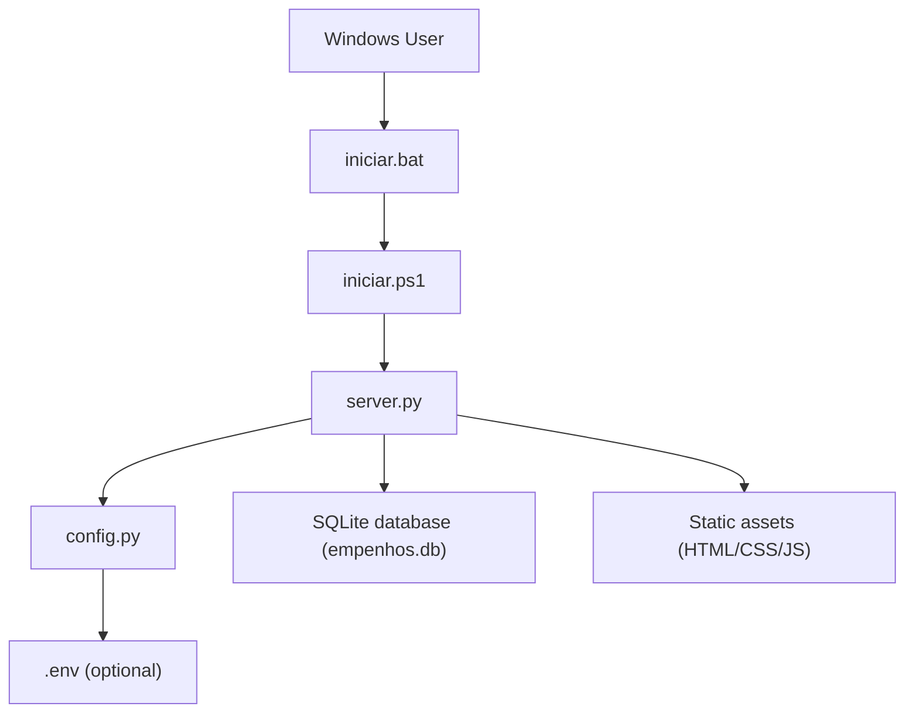
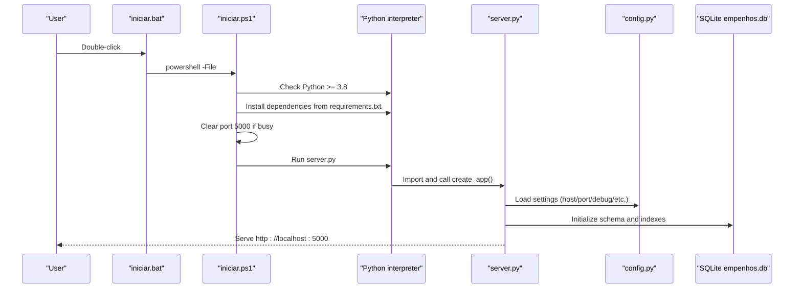
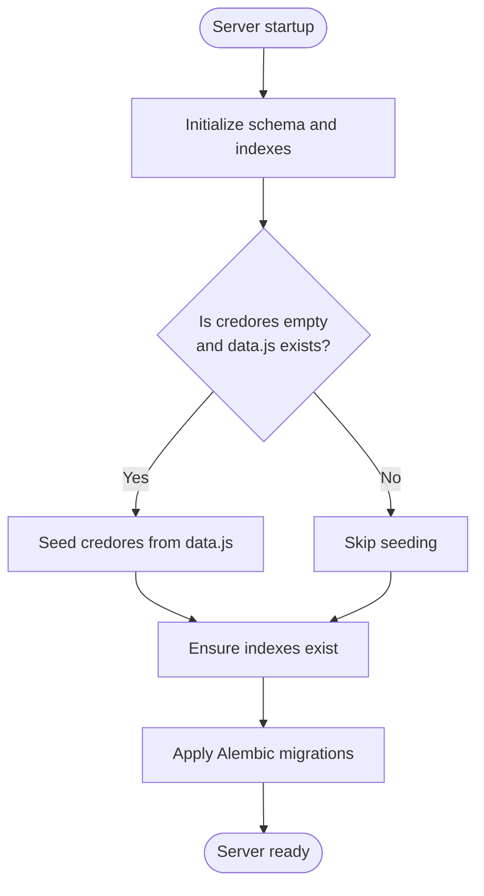
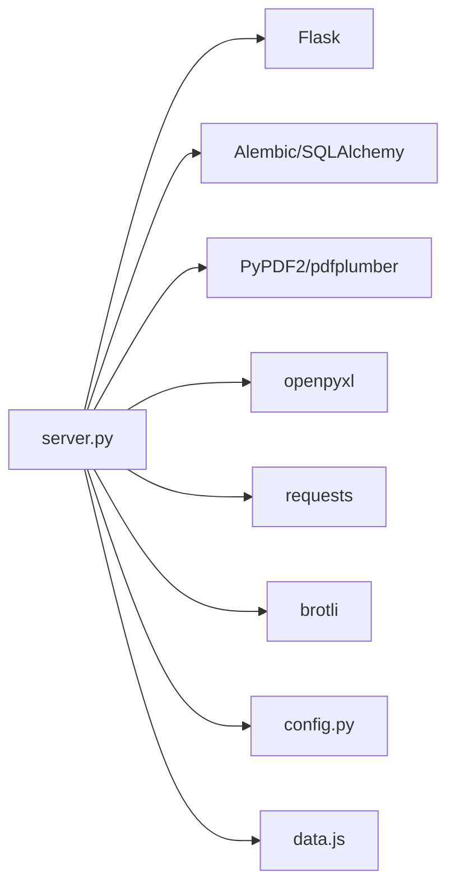

# Getting Started

<cite>
**Referenced Files in This Document**
- [README.md](file://README.md)
- [requirements.txt](file://requirements.txt)
- [iniciar.bat](file://iniciar.bat)
- [iniciar.ps1](file://iniciar.ps1)
- [server.py](file://server.py)
- [config.py](file://config.py)
- [data.js](file://data.js)
- [migration_rodar.bat](file://migration_rodar.bat)
- [migration_status.bat](file://migration_status.bat)
- [MIGRATIONS_GUIA.md](file://MIGRATIONS_GUIA.md)
- [BACKUP_GUIA_RAPIDO.md](file://BACKUP_GUIA_RAPIDO.md)
- [GUIA_RAPIDO.md](file://GUIA_RAPIDO.md)
</cite>

## Table of Contents
1. [Introduction](#introduction)
2. [Project Structure](#project-structure)
3. [Core Components](#core-components)
4. [Architecture Overview](#architecture-overview)
5. [Detailed Component Analysis](#detailed-component-analysis)
6. [Dependency Analysis](#dependency-analysis)
7. [Performance Considerations](#performance-considerations)
8. [Troubleshooting Guide](#troubleshooting-guide)
9. [Conclusion](#conclusion)
10. [Appendices](#appendices)

## Introduction
This guide helps you install, configure, and run the municipal financial management system on Windows. It covers:
- Environment setup (Python 3.8+)
- Installing dependencies from requirements.txt
- Starting the server using iniciar.bat or manual commands
- Accessing the system locally at http://localhost:5000
- Basic configuration via environment variables
- Initial database setup and migrations
- Troubleshooting common installation issues
- Next steps for users and developers

## Project Structure
At a high level, the system consists of:
- A Flask server entrypoint that initializes the application, database, and static asset caching
- A configuration module that reads environment variables
- A SQLite-backed schema initialized on first run
- Helper scripts for quick startup, development, and maintenance

**Diagram sources**
- [iniciar.bat:1-3](file://iniciar.bat#L1-L3)
- [iniciar.ps1:1-327](file://iniciar.ps1#L1-L327)
- [server.py:1-476](file://server.py#L1-L476)
- [config.py:1-64](file://config.py#L1-L64)

**Section sources**
- [README.md:1-396](file://README.md#L1-L396)
- [server.py:1-476](file://server.py#L1-L476)
- [config.py:1-64](file://config.py#L1-L64)

## Core Components
- Server entrypoint and initialization:
  - Creates the Flask app, sets up logging, registers error handlers, and prepares static caching
  - Initializes and migrates the SQLite database on startup
  - Starts the development server bound to configured host/port
- Configuration:
  - Reads environment variables for host, port, debug/reloader flags, admin password, and AI service settings
  - Loads optional .env file if present
- Static asset caching:
  - Preloads and compresses static files for fast local serving
- Data seeding:
  - Seeds the database from data.js if the credores table is empty

**Section sources**
- [server.py:113-476](file://server.py#L113-L476)
- [config.py:18-64](file://config.py#L18-L64)
- [data.js:1-200](file://data.js#L1-L200)

## Architecture Overview
The runtime flow starts with a Windows batch launcher that invokes a PowerShell script. The script verifies prerequisites, installs missing dependencies, clears port conflicts, and launches the Flask server. The server initializes the app factory, ensures database tables and indexes exist, and serves static assets from memory.

**Diagram sources**
- [iniciar.bat:1-3](file://iniciar.bat#L1-L3)
- [iniciar.ps1:41-327](file://iniciar.ps1#L41-L327)
- [server.py:425-476](file://server.py#L425-L476)
- [config.py:18-64](file://config.py#L18-L64)

## Detailed Component Analysis

### Quick Start on Windows
- Option 1: Double-click the launcher
  - iniciar.bat invokes iniciar.ps1, which performs checks and starts the server automatically
- Option 2: Manual terminal commands
  - Install dependencies: pip install -r requirements.txt
  - Start server: python server.py
- Access the system at http://localhost:5000

**Section sources**
- [README.md:8-21](file://README.md#L8-L21)
- [iniciar.bat:1-3](file://iniciar.bat#L1-L3)
- [iniciar.ps1:201-327](file://iniciar.ps1#L201-L327)

### Environment Setup and Requirements
- Python 3.8+ is required
- Dependencies are defined in requirements.txt and installed automatically by the PowerShell installer or manually via pip
- Optional .env file is loaded at startup to set environment variables

**Section sources**
- [README.md:20-21](file://README.md#L20-L21)
- [requirements.txt:1-10](file://requirements.txt#L1-L10)
- [iniciar.ps1:92-145](file://iniciar.ps1#L92-L145)
- [config.py:8-16](file://config.py#L8-L16)

### Basic Configuration via Environment Variables
Key variables supported by the configuration module:
- APP_HOST — server host binding (default: 0.0.0.0)
- APP_PORT — HTTP port (default: 5000)
- APP_DEBUG — enable debug mode (true/1/yes/on)
- APP_RELOADER — enable reloader (true/1/yes/on)
- ADM_PASSWORD — administrative area password
- OPENROUTER_* — AI service settings (API key, model, referer, title, timeouts, retries, cache TTL)

These are read from environment variables or .env if present.

**Section sources**
- [README.md:22-34](file://README.md#L22-L34)
- [config.py:18-64](file://config.py#L18-L64)

### Initial Database Setup
On first run, the server:
- Ensures core tables exist (including credores, empenhos, logs, rpas, kanban_tasks, etc.)
- Creates optimized indexes for performance
- Seeds the credores table from data.js if empty
- Applies Alembic migrations to evolve the schema

**Diagram sources**
- [server.py:130-282](file://server.py#L130-L282)
- [data.js:1-200](file://data.js#L1-L200)

**Section sources**
- [server.py:130-282](file://server.py#L130-L282)
- [README.md:307-396](file://README.md#L307-L396)

### Migrations Management
- Use migration scripts to check status, run pending migrations, create new ones, or revert
- Alembic is included in requirements and used for schema evolution

Common commands:
- migration_status.bat — show migration history and current/head
- migration_rodar.bat — apply pending migrations
- migration_criar.bat "<description>" — create a new migration
- migration_reverter.bat — revert last migration

**Section sources**
- [migration_status.bat:1-35](file://migration_status.bat#L1-L35)
- [migration_rodar.bat:1-38](file://migration_rodar.bat#L1-L38)
- [MIGRATIONS_GUIA.md:26-57](file://MIGRATIONS_GUIA.md#L26-L57)

### Backup Automation
- Automated daily backups of empenhos.db with integrity checks and rotation
- Schedule via Task Scheduler using provided scripts
- Verify, list, restore, and cancel backup tasks

**Section sources**
- [BACKUP_GUIA_RAPIDO.md:1-118](file://BACKUP_GUIA_RAPIDO.md#L1-L118)

### Developer Quick Start (Dev Environment)
- Use dev.ps1 to launch Flask with debug/reloader, optionally start Cloudflare Tunnel, and run the Telegram bot
- Automatically detects Python, Flask app, and bot files
- Provides summary URLs and cleanup on exit

**Section sources**
- [dev.ps1:1-490](file://dev.ps1#L1-L490)

## Dependency Analysis
The server imports and uses:
- Flask for routing and WSGI
- SQLAlchemy/Alembic for ORM and migrations
- PDF libraries for document processing
- Requests for external integrations
- brotli for compression
- Additional modules for AI services and OCR

**Diagram sources**
- [server.py:31-33](file://server.py#L31-L33)
- [requirements.txt:1-10](file://requirements.txt#L1-L10)
- [config.py:1-64](file://config.py#L1-L64)
- [data.js:1-200](file://data.js#L1-L200)

**Section sources**
- [requirements.txt:1-10](file://requirements.txt#L1-L10)
- [server.py:31-33](file://server.py#L31-L33)

## Performance Considerations
- Static file caching: The server preloads and compresses static assets to improve response times
- Database indexing: The server creates many optimized indexes to accelerate queries
- Recommendations:
  - Keep APP_DEBUG disabled in production
  - Use migrations to evolve schema safely
  - Monitor logs in logs/server.log for performance insights

[No sources needed since this section provides general guidance]

## Troubleshooting Guide

### Python Not Found or Version Too Low
- Symptom: The PowerShell installer reports Python not found or incompatible
- Fix: Install Python 3.8+ and ensure it is on PATH

**Section sources**
- [iniciar.ps1:41-71](file://iniciar.ps1#L41-L71)

### Port 5000 Already in Use
- Symptom: Server fails to bind to port 5000
- Fix: The installer attempts to terminate the owning process; if still blocked, manually stop the process or change APP_PORT

**Section sources**
- [iniciar.ps1:150-181](file://iniciar.ps1#L150-L181)
- [config.py:25-27](file://config.py#L25-L27)

### Missing Dependencies
- Symptom: Import errors for Flask, SQLAlchemy, or others
- Fix: Run pip install -r requirements.txt or let the installer handle it

**Section sources**
- [requirements.txt:1-10](file://requirements.txt#L1-L10)
- [iniciar.ps1:92-145](file://iniciar.ps1#L92-L145)

### Database Initialization Issues
- Symptom: Schema errors or missing tables
- Fix: Ensure server.py runs once to initialize schema and indexes; verify empenhos.db exists in the project root

**Section sources**
- [server.py:130-282](file://server.py#L130-L282)

### Migrations Fail or Are Pending
- Symptom: Migration status shows pending heads
- Fix: Run migration_rodar.bat to apply pending migrations

**Section sources**
- [migration_rodar.bat:22-35](file://migration_rodar.bat#L22-L35)
- [migration_status.bat:23-31](file://migration_status.bat#L23-L31)

### Backup Automation Problems
- Symptom: Scheduled backup does not run
- Fix: Confirm Task Scheduler task exists, run it manually, and check logs in logs/backup.log

**Section sources**
- [BACKUP_GUIA_RAPIDO.md:83-118](file://BACKUP_GUIA_RAPIDO.md#L83-L118)

### Next Steps for Users
- Explore the UI at http://localhost:5000
- Review API endpoints documented in README.md
- Seed or update data via data.js and restart the server

**Section sources**
- [README.md:83-106](file://README.md#L83-L106)
- [data.js:1-200](file://data.js#L1-L200)

### Next Steps for Developers
- Enable debug mode via APP_DEBUG and APP_RELOADER
- Use dev.ps1 for a full development stack (Flask + optional tunnel + Telegram bot)
- Apply performance improvements from GUIA_RAPIDO.md (indexes, health endpoints, etc.)

**Section sources**
- [GUIA_RAPIDO.md:1-200](file://GUIA_RAPIDO.md#L1-L200)
- [dev.ps1:1-490](file://dev.ps1#L1-L490)

## Conclusion
You now have everything needed to install, configure, and run the municipal financial management system on Windows. Start with iniciar.bat for a guided setup, or use manual commands for more control. Access the system at http://localhost:5000, manage the database with migrations, and automate backups. Refer to the troubleshooting section for common issues and explore the developer-focused scripts for advanced workflows.

[No sources needed since this section summarizes without analyzing specific files]

## Appendices

### Appendix A: Environment Variables Reference
- APP_HOST — server host binding
- APP_PORT — HTTP port
- APP_DEBUG — enable debug mode
- APP_RELOADER — enable reloader
- ADM_PASSWORD — administrative area password
- OPENROUTER_API_KEY — AI service API key
- OPENROUTER_MODEL — default AI model
- OPENROUTER_DEFAULT_MODEL — default model for extrato organizer
- OPENROUTER_CHAT_MODEL — chat proxy model
- OPENROUTER_REFERER — HTTP referer header for OpenRouter
- OPENROUTER_TITLE — X-Title header for OpenRouter
- OPENROUTER_TIMEOUT_SECONDS — request timeout
- OPENROUTER_MAX_RETRIES — retry attempts
- OPENROUTER_BACKOFF_BASE — exponential backoff base
- OPENROUTER_CACHE_TTL_SECONDS — cache TTL

**Section sources**
- [config.py:18-64](file://config.py#L18-L64)