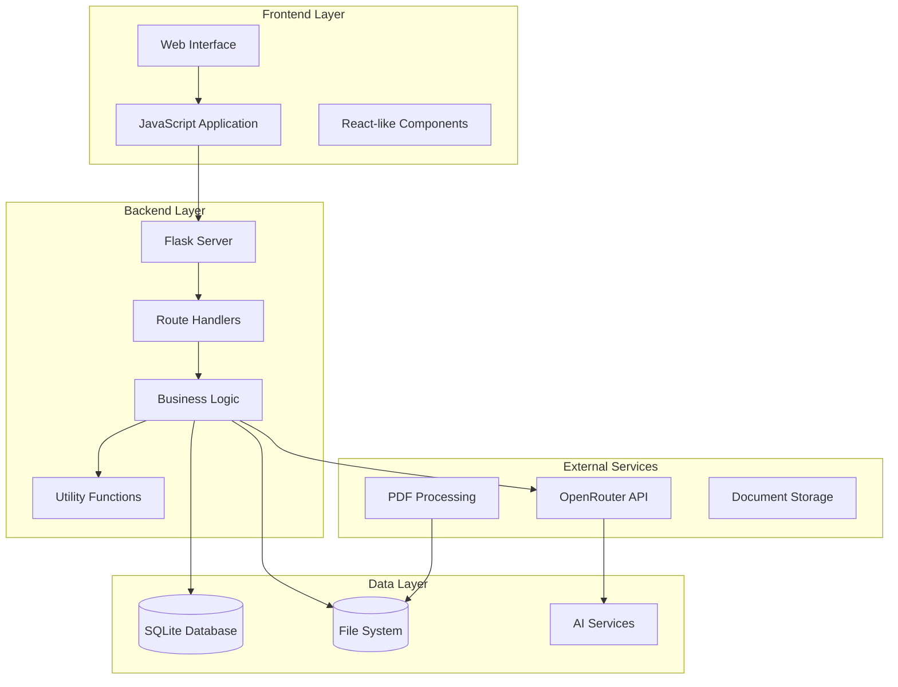
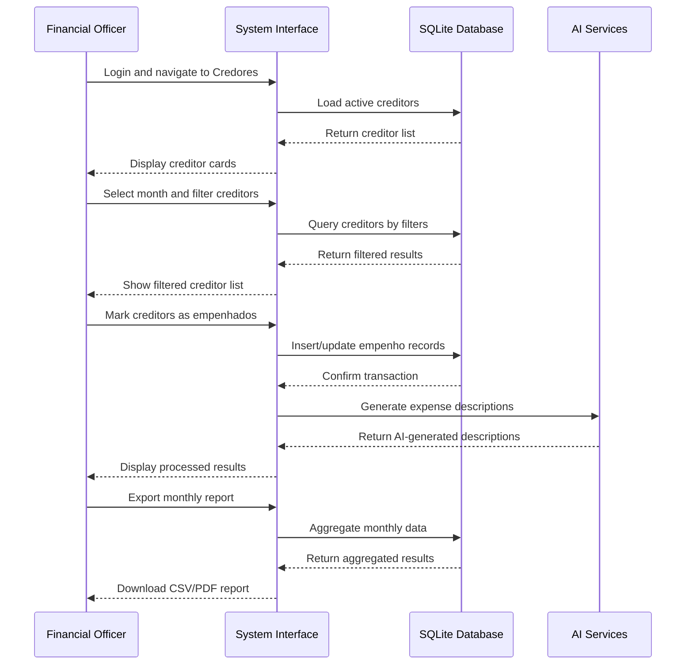
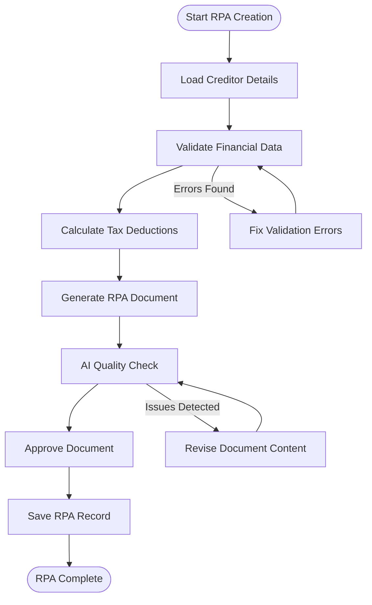

# Project Overview

<cite>
**Referenced Files in This Document**
- [README.md](file://README.md)
- [server.py](file://server.py)
- [app/__init__.py](file://app/__init__.py)
- [requirements.txt](file://requirements.txt)
- [config.py](file://config.py)
- [app/routes/credores.py](file://app/routes/credores.py)
- [app/routes/empenhos.py](file://app/routes/empenhos.py)
- [app/routes/rpas.py](file://app/routes/rpas.py)
- [app/routes/extratos.py](file://app/routes/extratos.py)
- [index.html](file://index.html)
- [static/js/app.js](file://static/js/app.js)
- [static/js/shared-header.js](file://static/js/shared-header.js)
- [services/extratos_service.py](file://services/extratos_service.py)
- [services/openrouter_service.py](file://services/openrouter_service.py)
- [app/routes/ia.py](file://app/routes/ia.py)
- [pages/manual.html](file://pages/manual.html)
</cite>

## Table of Contents
1. [Introduction](#introduction)
2. [System Architecture](#system-architecture)
3. [Target Audience](#target-audience)
4. [Key Benefits](#key-benefits)
5. [System Requirements](#system-requirements)
6. [High-Level Features](#high-level-features)
7. [Common Workflows](#common-workflows)
8. [Technical Implementation Highlights](#technical-implementation-highlights)
9. [Performance and Scalability](#performance-and-scalability)
10. [Security Considerations](#security-considerations)
11. [Conclusion](#conclusion)

## Introduction

The **Sistema de Controle de Empenhos Mensais** is a comprehensive web-based financial management platform designed specifically for the Prefeitura Municipal de Inajá. This system serves as a centralized digital solution for managing municipal financial processes, with a particular focus on creditor administration, monthly expense orders (empenhos), Recibos de Pagamento Autônomo (RPAs), and bank statement processing.

The platform addresses the complex financial management needs of a municipal government by providing an integrated environment where financial officers can efficiently track, process, and monitor all aspects of municipal spending. The system combines modern web technologies with robust backend infrastructure to deliver a reliable, scalable solution for municipal financial administration.

## System Architecture

The system follows a modern three-tier architecture pattern, combining a Flask-based backend with a sophisticated frontend interface and intelligent AI-powered services.

**Diagram sources**
- [server.py:113-421](file://server.py#L113-L421)
- [app/__init__.py:28-64](file://app/__init__.py#L28-L64)

The architecture consists of several key architectural layers:

### Backend Foundation
The Flask application serves as the core backend, implementing a modular blueprint-based routing system. The application factory pattern ensures clean separation of concerns and supports both development and production environments seamlessly.

### Frontend Architecture
The frontend utilizes a sophisticated JavaScript application built around a reactive state management system. The interface follows modern design principles with responsive layouts, dark/light theme support, and comprehensive accessibility features.

### Data Management
The system employs SQLite as its primary database, leveraging its lightweight nature and reliability for municipal financial data storage. The database schema includes comprehensive indexing strategies and constraint enforcement to ensure data integrity.

### AI Integration
Advanced AI capabilities are integrated through OpenRouter services, enabling intelligent document processing, classification, and analysis of financial documents and statements.

**Section sources**
- [server.py:113-421](file://server.py#L113-L421)
- [app/__init__.py:28-64](file://app/__init__.py#L28-L64)

## Target Audience

The system serves multiple stakeholder groups within the municipal government structure:

### Primary Users
- **Financial Officers**: Responsible for day-to-day financial management, expense processing, and creditor administration
- **Administrative Staff**: Handle document management, report generation, and financial reporting
- **Department Heads**: Monitor departmental spending and approve financial transactions
- **Auditors**: Conduct financial reviews and compliance checks

### Secondary Users
- **City Council Members**: Review financial reports and budget allocations
- **External Auditors**: Perform independent financial audits
- **Technical Support**: Maintain system infrastructure and user support

### User Requirements
The system accommodates users with varying technical expertise levels, from basic financial staff to advanced system administrators, through intuitive interfaces and comprehensive help systems.

## Key Benefits

### Operational Efficiency
- **Streamlined Processes**: Eliminates paper-based workflows and reduces administrative overhead
- **Real-time Tracking**: Provides instant visibility into financial transactions and creditor status
- **Automated Workflows**: Reduces manual data entry and minimizes human error through automated processing

### Financial Control
- **Enhanced Transparency**: Comprehensive audit trails and transaction histories
- **Budget Compliance**: Built-in controls ensure adherence to municipal budget guidelines
- **Risk Mitigation**: Early warning systems for overdue payments and financial irregularities

### Technology Advantages
- **Modern Infrastructure**: Leverages current web standards and best practices
- **Scalable Design**: Architecture supports growth and additional municipalities
- **Cost-Effective**: Utilizes open-source technologies and local infrastructure

### User Experience
- **Intuitive Interface**: Designed with municipal workers' needs in mind
- **Mobile Compatibility**: Accessible across various devices and platforms
- **Training Support**: Comprehensive documentation and training materials

## System Requirements

### Hardware Requirements
- **Minimum**: Quad-core processor, 8GB RAM, 50GB disk space
- **Recommended**: Hexa-core processor, 16GB+ RAM, 100GB+ disk space
- **Database Growth**: Additional 1GB per 1,000 financial records processed annually

### Software Requirements
- **Operating Systems**: Windows 10+, Linux Ubuntu 18.04+, macOS 10.15+
- **Browser Support**: Chrome 90+, Firefox 86+, Safari 14+, Edge 90+
- **Python Runtime**: Python 3.8+ with pip package manager

### Network Requirements
- **Local Network**: Ethernet connection with minimum 100Mbps bandwidth
- **Internet Access**: Required for AI services and updates
- **Security**: HTTPS encryption and firewall protection recommended

### Database Specifications
- **Storage Capacity**: Dynamically scales with financial activity volume
- **Backup Requirements**: Automated daily backups with retention policies
- **Performance**: Optimized queries with comprehensive indexing strategy

**Section sources**
- [requirements.txt:1-10](file://requirements.txt#L1-L10)
- [config.py:18-64](file://config.py#L18-L64)

## High-Level Features

### Creditor Management
The system provides comprehensive creditor administration with advanced filtering, categorization, and status tracking capabilities. Users can manage creditor profiles, payment terms, contract validity periods, and departmental associations.

### Expense Order Processing
Automated expense order generation and management system supporting batch processing, approval workflows, and integration with municipal accounting systems. The platform handles both fixed and variable payment types with appropriate validation and audit trails.

### RPA Management
Complete Recibo de Pagamento Autônomo (RPA) processing including automatic calculation of deductions, tax computations, and document generation. The system maintains historical RPA records with detailed breakdowns.

### Bank Statement Integration
Sophisticated bank statement processing with AI-powered categorization, automated reconciliation, and anomaly detection. The system supports multiple file formats and integrates with municipal banking systems.

### Document Management
Centralized document storage with intelligent categorization, search capabilities, and version control. Supports PDF manipulation, document assembly, and secure storage of sensitive financial information.

### Reporting and Analytics
Comprehensive reporting suite with customizable dashboards, trend analysis, and compliance reporting. Real-time financial metrics and automated report generation capabilities.

### Administrative Tools
Integrated administrative functions including user management, system configuration, backup management, and maintenance tools. The system includes comprehensive logging and audit capabilities.

**Section sources**
- [app/routes/credores.py:25-225](file://app/routes/credores.py#L25-L225)
- [app/routes/empenhos.py:12-123](file://app/routes/empenhos.py#L12-L123)
- [app/routes/rpas.py:12-131](file://app/routes/rpas.py#L12-L131)
- [app/routes/extratos.py:14-131](file://app/routes/extratos.py#L14-L131)

## Common Workflows

### Monthly Expense Processing

**Diagram sources**
- [static/js/app.js:166-189](file://static/js/app.js#L166-L189)
- [app/routes/empenhos.py:31-82](file://app/routes/empenhos.py#L31-L82)

### RPA Generation Workflow

**Diagram sources**
- [app/routes/rpas.py:23-71](file://app/routes/rpas.py#L23-L71)
- [services/extratos_service.py:51-70](file://services/extratos_service.py#L51-L70)

### Bank Statement Processing

```mermaid
flowchart LR
Upload[Upload Bank Statements] --> Validate[Validate File Formats]
Validate --> Extract[Extract Transaction Data]
Extract --> AIProcess[AI-Powered Categorization]
AIProcess --> Review[Manual Review]
Review --> Categorize[Categorize Transactions]
Categorize --> Match[Match with Expenses]
Match --> Reconcile[Reconcile with Records]
Reconcile --> GenerateReport[Generate Processing Report]
GenerateReport --> Archive[Archive Processed Files]
Validate --> |Invalid Format| Error[Show Error Message]
AIProcess --> |Uncertain Categories| Flag[Flag for Manual Review]
Flag --> Review
```

**Diagram sources**
- [services/extratos_service.py:51-70](file://services/extratos_service.py#L51-L70)
- [app/routes/extratos.py:115-131](file://app/routes/extratos.py#L115-L131)

**Section sources**
- [static/js/app.js:764-785](file://static/js/app.js#L764-L785)
- [pages/manual.html:1-200](file://pages/manual.html#L1-L200)

## Technical Implementation Highlights

### Flask Application Architecture
The backend implements a modular blueprint-based routing system that separates concerns across different functional domains. The application factory pattern ensures proper initialization and configuration management.

### Database Design
The SQLite database schema includes comprehensive tables for creditors, expense orders, RPAs, and supporting infrastructure. Advanced indexing strategies optimize query performance for common financial operations.

### Frontend JavaScript Framework
The client-side application uses a sophisticated state management system with reactive components, caching mechanisms, and offline capability. The interface adapts dynamically to user interactions and system responses.

### AI Integration Architecture
Integration with OpenRouter services enables advanced document processing, natural language understanding, and automated financial analysis. The system includes intelligent fallback mechanisms and error handling.

### Security Implementation
Multi-layered security approach including authentication, authorization, input validation, and audit logging. The system maintains comprehensive activity logs for compliance and security monitoring.

### Performance Optimization
Comprehensive caching strategies, database optimization, and efficient API design ensure responsive performance under typical municipal workloads. The system includes monitoring and alerting for performance degradation.

**Section sources**
- [server.py:113-421](file://server.py#L113-L421)
- [app/__init__.py:107-162](file://app/__init__.py#L107-L162)
- [services/openrouter_service.py:72-136](file://services/openrouter_service.py#L72-L136)

## Performance and Scalability

### Database Performance
The system includes 59 optimized indexes across 12+ tables, with specialized indexes for common query patterns. Performance benchmarks demonstrate sub-millisecond response times for typical financial queries.

### Caching Strategy
Multi-level caching system including API response caching, static asset compression, and intelligent data prefetching. The system automatically invalidates caches during data modifications to ensure consistency.

### Scalability Considerations
Horizontal scaling capabilities through load balancing and database clustering. The system can accommodate growing municipal financial volumes through database optimization and hardware upgrades.

### Monitoring and Maintenance
Comprehensive logging system with performance metrics, error tracking, and system health monitoring. Automated maintenance tasks including database optimization and cleanup routines.

## Security Considerations

### Access Control
Role-based access control with granular permissions for different user types. Session management with automatic timeout and secure credential handling.

### Data Protection
Encryption at rest for sensitive financial data, secure transmission protocols, and regular security audits. Data retention policies ensure compliance with municipal record-keeping requirements.

### Audit Trail
Comprehensive transaction logging with detailed audit trails for all financial operations. Compliance reporting capabilities for municipal oversight requirements.

### System Security
Regular security updates, vulnerability scanning, and secure deployment practices. Network security measures including firewall configuration and intrusion detection.

## Conclusion

The Prefeitura Municipal de Inajá financial management system represents a comprehensive digital transformation of municipal financial processes. By combining modern web technologies with robust backend infrastructure and intelligent AI capabilities, the system delivers significant improvements in operational efficiency, financial control, and transparency.

The platform's modular architecture ensures maintainability and scalability, while its comprehensive feature set addresses the complex needs of municipal financial administration. The system's emphasis on user experience, security, and performance positions it as a valuable asset for sustainable municipal governance.

Through automation of routine financial processes, enhanced reporting capabilities, and improved compliance monitoring, the system enables municipal governments to focus on strategic financial management rather than administrative overhead. The foundation established by this platform supports continued innovation and adaptation to evolving municipal financial requirements.