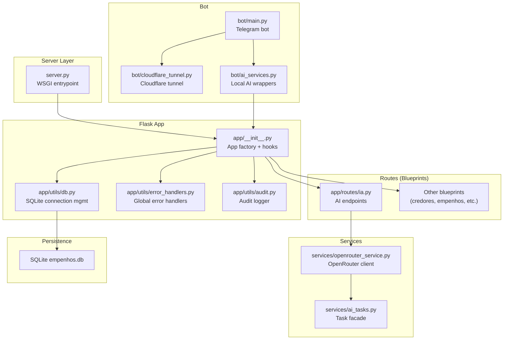
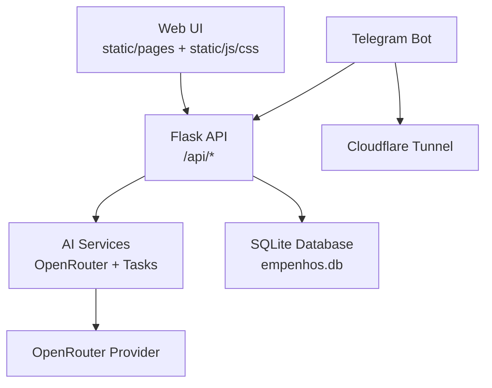
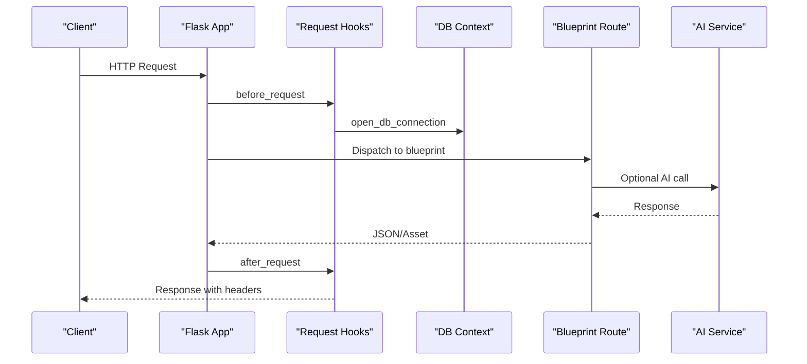
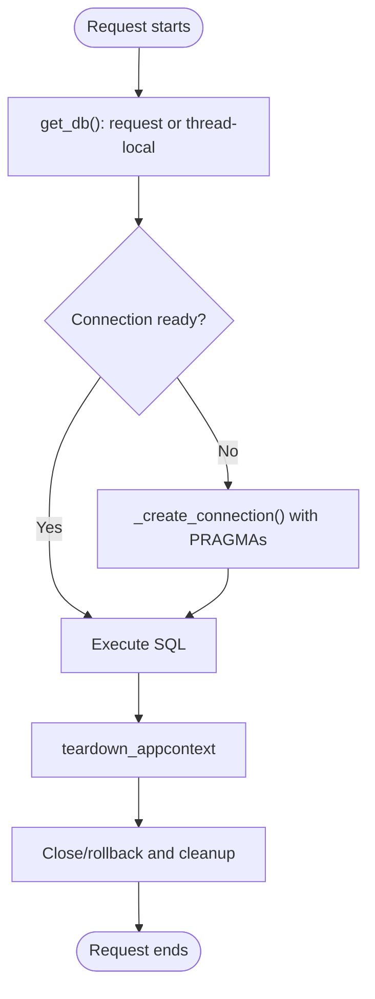
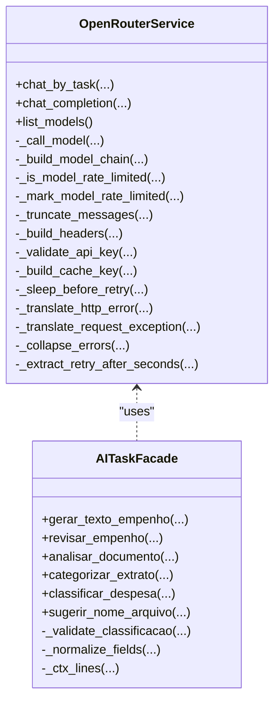
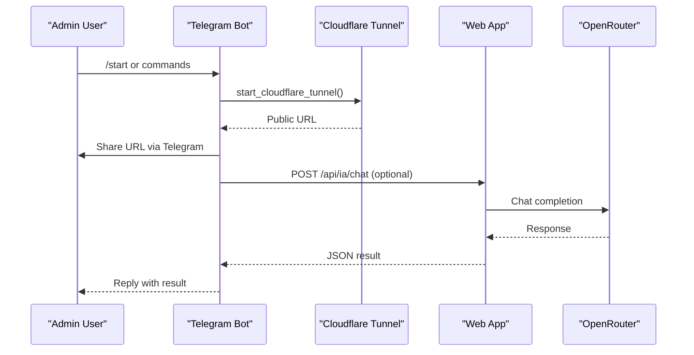
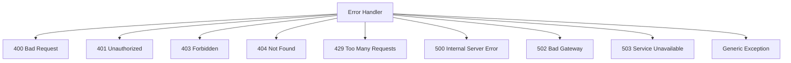
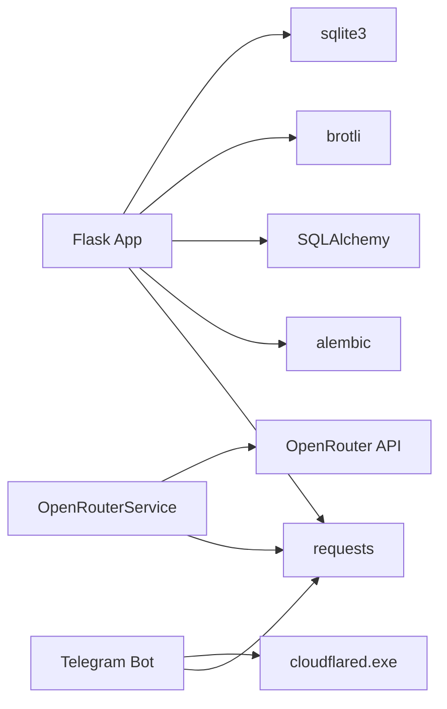

# System Architecture

<cite>
**Referenced Files in This Document**
- [server.py](file://server.py)
- [app/__init__.py](file://app/__init__.py)
- [config.py](file://config.py)
- [app/utils/db.py](file://app/utils/db.py)
- [app/utils/error_handlers.py](file://app/utils/error_handlers.py)
- [app/utils/audit.py](file://app/utils/audit.py)
- [app/routes/ia.py](file://app/routes/ia.py)
- [services/openrouter_service.py](file://services/openrouter_service.py)
- [services/ai_tasks.py](file://services/ai_tasks.py)
- [bot/main.py](file://bot/main.py)
- [bot/cloudflare_tunnel.py](file://bot/cloudflare_tunnel.py)
- [bot/ai_services.py](file://bot/ai_services.py)
- [requirements.txt](file://requirements.txt)
- [README.md](file://README.md)
</cite>

## Table of Contents
1. [Introduction](#introduction)
2. [Project Structure](#project-structure)
3. [Core Components](#core-components)
4. [Architecture Overview](#architecture-overview)
5. [Detailed Component Analysis](#detailed-component-analysis)
6. [Dependency Analysis](#dependency-analysis)
7. [Performance Considerations](#performance-considerations)
8. [Troubleshooting Guide](#troubleshooting-guide)
9. [Conclusion](#conclusion)
10. [Appendices](#appendices)

## Introduction
This document describes the system architecture of the municipal financial management platform for Prefeitura Municipal de Inajá. It covers the Flask application factory pattern, blueprint-based routing, layered architecture, and the integration of AI processing modules and the database layer. It also documents system boundaries, data flows, cross-cutting concerns (authentication, error handling, logging), technology stack, third-party dependencies, and deployment topology.

## Project Structure
The project follows a modular layout:
- server.py: Entrypoint and server bootstrap, including static file caching and database initialization.
- app/: Modular Flask application with blueprints for domain areas.
- app/utils/: Shared utilities for DB connections, error handling, auditing, and helpers.
- app/routes/: Domain-specific blueprints (e.g., credores, empenhos, ia, auth).
- services/: Business logic and integrations with external AI providers.
- bot/: Telegram bot integrating with the web app and Cloudflare tunnel.
- static/pages/: Frontend assets and HTML pages served by the Flask app.
- migrations/: Alembic-based database migrations.

**Diagram sources**
- [server.py](file://server.py)
- [app/__init__.py](file://app/__init__.py)
- [app/utils/db.py](file://app/utils/db.py)
- [app/utils/error_handlers.py](file://app/utils/error_handlers.py)
- [app/utils/audit.py](file://app/utils/audit.py)
- [app/routes/ia.py](file://app/routes/ia.py)
- [services/openrouter_service.py](file://services/openrouter_service.py)
- [services/ai_tasks.py](file://services/ai_tasks.py)
- [bot/main.py](file://bot/main.py)
- [bot/cloudflare_tunnel.py](file://bot/cloudflare_tunnel.py)
- [bot/ai_services.py](file://bot/ai_services.py)

**Section sources**
- [README.md](file://README.md)
- [server.py](file://server.py)
- [app/__init__.py](file://app/__init__.py)

## Core Components
- Application Factory: Creates and configures the Flask app, registers blueprints, logging, error handlers, and request hooks.
- Database Layer: SQLite-backed with thread-safe connection management and optimized PRAGMAs.
- AI Integration: OpenRouter client with retry/backoff, TTL caching, and model policies; task facade for structured workflows.
- Telegram Bot: Asynchronous bot that communicates with the web app and shares a public Cloudflare tunnel URL.
- Static Serving: Optimized static file cache with preloading, compression, and ETag support.

**Section sources**
- [app/__init__.py](file://app/__init__.py)
- [app/utils/db.py](file://app/utils/db.py)
- [services/openrouter_service.py](file://services/openrouter_service.py)
- [services/ai_tasks.py](file://services/ai_tasks.py)
- [bot/main.py](file://bot/main.py)
- [bot/cloudflare_tunnel.py](file://bot/cloudflare_tunnel.py)
- [bot/ai_services.py](file://bot/ai_services.py)

## Architecture Overview
The system employs a layered architecture:
- Presentation Layer: Flask blueprints expose REST endpoints and serve static assets.
- Service Layer: AI services encapsulate external provider interactions and orchestrate tasks.
- Persistence Layer: SQLite database with Alembic migrations and integrity constraints.
- Integration Layer: Telegram bot and Cloudflare tunnel for external access and notifications.

**Diagram sources**
- [app/__init__.py](file://app/__init__.py)
- [app/routes/ia.py](file://app/routes/ia.py)
- [services/openrouter_service.py](file://services/openrouter_service.py)
- [services/ai_tasks.py](file://services/ai_tasks.py)
- [bot/main.py](file://bot/main.py)
- [bot/cloudflare_tunnel.py](file://bot/cloudflare_tunnel.py)

## Detailed Component Analysis

### Flask Application Factory and Routing
- Factory initializes logging, DB context connection, global error handlers, and registers blueprints under /api and /api/v1.
- Request hooks add timing headers, slow request warnings, and cache-control for GET responses.
- Static routes serve index.html, static assets, and pages with aggressive caching and compression.

**Diagram sources**
- [app/__init__.py](file://app/__init__.py)
- [app/utils/db.py](file://app/utils/db.py)
- [app/routes/ia.py](file://app/routes/ia.py)
- [services/openrouter_service.py](file://services/openrouter_service.py)

**Section sources**
- [app/__init__.py](file://app/__init__.py)
- [app/utils/db.py](file://app/utils/db.py)

### Database Layer and Thread-Safe Connections
- Thread-local storage ensures each OS thread gets its own SQLite connection outside request context.
- Request-scoped connections are opened before request and closed on teardown with rollback on exceptions.
- Optimized PRAGMAs improve concurrency and performance characteristics.
- Indexes and constraints are maintained via server initialization and Alembic migrations.

**Diagram sources**
- [app/utils/db.py](file://app/utils/db.py)

**Section sources**
- [app/utils/db.py](file://app/utils/db.py)
- [server.py](file://server.py)

### AI Processing Modules and OpenRouter Integration
- OpenRouterService encapsulates provider communication with retries, backoff, rate-limit handling, TTL caching, and model policies.
- AITaskFacade orchestrates structured tasks (e.g., empenho generation, document review, extrato categorization).
- Flask routes delegate to AI services and return normalized results or structured JSON.

**Diagram sources**
- [services/openrouter_service.py](file://services/openrouter_service.py)
- [services/ai_tasks.py](file://services/ai_tasks.py)

**Section sources**
- [services/openrouter_service.py](file://services/openrouter_service.py)
- [services/ai_tasks.py](file://services/ai_tasks.py)
- [app/routes/ia.py](file://app/routes/ia.py)

### Telegram Bot Integration and Cloudflare Tunnel
- The Telegram bot runs asynchronously, handles commands and media, and sends periodic notifications.
- It retrieves a public URL from a Cloudflare tunnel and shares it with administrators.
- The bot can call local AI endpoints and supports vision prompts.

**Diagram sources**
- [bot/main.py](file://bot/main.py)
- [bot/cloudflare_tunnel.py](file://bot/cloudflare_tunnel.py)
- [bot/ai_services.py](file://bot/ai_services.py)
- [app/routes/ia.py](file://app/routes/ia.py)
- [services/openrouter_service.py](file://services/openrouter_service.py)

**Section sources**
- [bot/main.py](file://bot/main.py)
- [bot/cloudflare_tunnel.py](file://bot/cloudflare_tunnel.py)
- [bot/ai_services.py](file://bot/ai_services.py)

### Cross-Cutting Concerns
- Authentication: Admin password hash initialization and protected routes are registered during app creation.
- Error Handling: Global handlers standardize JSON responses for HTTP errors and unhandled exceptions.
- Logging: Structured logging with rotating files; dedicated audit logger for sensitive operations.
- Static Serving: Preloaded cache, ETags, gzip/brotli compression, and cache-control headers.

**Diagram sources**
- [app/utils/error_handlers.py](file://app/utils/error_handlers.py)

**Section sources**
- [app/__init__.py](file://app/__init__.py)
- [app/utils/error_handlers.py](file://app/utils/error_handlers.py)
- [app/utils/audit.py](file://app/utils/audit.py)

## Dependency Analysis
- Flask application depends on:
  - SQLite for persistence.
  - requests for HTTP integrations (OpenRouter, Telegram bot).
  - brotli for static compression.
  - alembic and SQLAlchemy for migrations.
- AI services depend on OpenRouter provider and implement robust retry/backoff logic.
- Bot depends on python-telegram-bot and Cloudflare tunnel binary.

**Diagram sources**
- [requirements.txt](file://requirements.txt)
- [app/__init__.py](file://app/__init__.py)
- [bot/main.py](file://bot/main.py)
- [services/openrouter_service.py](file://services/openrouter_service.py)

**Section sources**
- [requirements.txt](file://requirements.txt)
- [README.md](file://README.md)

## Performance Considerations
- Static file serving: Preloads files into memory, computes ETags, and serves compressed responses when supported.
- Database: Uses PRAGMAs tuned for concurrency and performance; indexes optimized for frequent queries.
- AI: TTL caching reduces repeated calls; model policies select appropriate models; retry/backoff mitigates transient failures.
- Request timing: X-Response-Time-ms header helps monitor slow endpoints.

[No sources needed since this section provides general guidance]

## Troubleshooting Guide
- Authentication failures: Verify admin password configuration and session lifetime.
- AI errors: Check OpenRouter API key and model configuration; inspect provider error translations.
- Database issues: Confirm PRAGMAs and indexes; use Alembic migrations to evolve schema safely.
- Static asset problems: Review cache preload logs and compression headers.
- Telegram bot: Ensure cloudflared.exe exists and accessible; confirm tunnel URL file is readable.

**Section sources**
- [config.py](file://config.py)
- [app/utils/error_handlers.py](file://app/utils/error_handlers.py)
- [services/openrouter_service.py](file://services/openrouter_service.py)
- [bot/cloudflare_tunnel.py](file://bot/cloudflare_tunnel.py)

## Conclusion
The system is designed around a clean Flask factory and blueprint architecture, with a focus on reliability and maintainability. SQLite provides a lightweight, embedded persistence layer, while AI services integrate external providers with resilience and caching. The Telegram bot extends accessibility and operational visibility. Together, these components deliver a cohesive, modular solution for municipal financial management.

[No sources needed since this section summarizes without analyzing specific files]

## Appendices

### Technology Stack and Dependencies
- Flask, PyPDF2, pdfplumber, openpyxl, requests, brotli, tavily-python, alembic, SQLAlchemy.

**Section sources**
- [requirements.txt](file://requirements.txt)

### Deployment Topology
- Single-instance WSGI server hosting both web and static assets.
- Optional Cloudflare tunnel exposes the app externally for administrative access.
- Alembic manages database migrations; SQLite file persists locally.

**Section sources**
- [README.md](file://README.md)
- [bot/cloudflare_tunnel.py](file://bot/cloudflare_tunnel.py)
- [server.py](file://server.py)